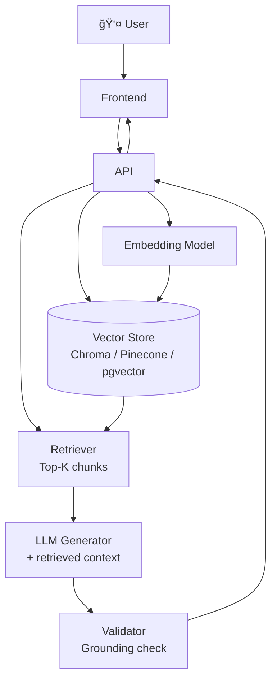
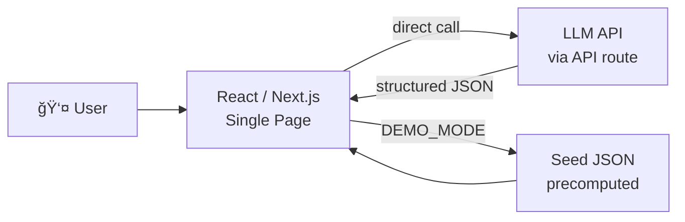

# Architecture & MVP — Module 07

## Purpose

Produce a complete, demo-ready technical specification for the winning idea. This module outputs everything the team needs to start building immediately: a Mermaid architecture diagram, data model, API contract, AI component spec, demo line, and build budget.

**Rule:** No implementation begins before this module is complete. Architecture before code.

---

## Step 1: Architecture Style Selection

Choose the architectural pattern that matches the idea and team:

| Style | When to Use | Complexity | Demo Risk |
|-------|------------|------------|-----------|
| **Monolith API** | Single team, fast iteration, < 48h | Low | Low |
| **Frontend + API** | Clear UI/backend split, 2+ people | Medium | Low |
| **Multi-service** | Complex logic, specialized agents | High | Medium |
| **Serverless** | Event-driven, team knows Vercel/Cloudflare | Medium | Medium |
| **Pure frontend** | Demo only, no persistence needed | Very Low | Very Low |

**For most hackathons:** Frontend + API (Next.js or React + FastAPI or Express). Default unless a specific reason exists.

---

## Step 2: Mermaid Architecture Diagram (MANDATORY)

**Always produce a Mermaid diagram. Text-only architecture is rejected.**

### Variant A — Standard Full-Stack (most common)

```mermaid
graph TD
  User[👤 User / Persona] --> FE[Frontend\nNext.js / React]
  FE --> |REST / fetch| API[API Layer\nFastAPI / Express]
  API --> |rule-based| CORE[Deterministic Core\nBusiness Logic]
  API --> |if AI enabled| AIL[AI Layer\nLLM + Validation]
  AIL --> |structured output| LLM[LLM API\nOpenAI / Claude / Gemini]
  CORE --> DB[(Database\nSQLite / Supabase / Postgres)]
  AIL --> |pre-computed| SEED[Demo Seed Data\nprecomputed_responses.json]
  FE --> |DEMO_MODE=true| SEED

  style SEED fill:#1a1a2e,stroke:#666,stroke-dasharray: 5 5
  style LLM fill:#1a1a2e,stroke:#666
```



### Variant B — Agent/Orchestration Architecture

```mermaid
graph TD
  User[👤 User] --> FE[Frontend]
  FE --> ORCH[Orchestrator Agent\nLangGraph / CrewAI]
  ORCH --> A1[Agent 1\nData Fetcher]
  ORCH --> A2[Agent 2\nAnalyzer]
  ORCH --> A3[Agent 3\nSynthesizer]
  A1 --> DS[Data Sources\nAPI / DB / Files]
  A2 --> LLM[LLM API]
  A3 --> LLM
  ORCH --> OUT[Structured Output\nJSON Schema]
  OUT --> FE

  style DS fill:#1a1a2e,stroke:#666
```



### Variant C — RAG / Knowledge Base



### Variant D — Minimal / Pure Frontend + AI



**Diagram must always show:**
- User entry point
- Every non-trivial component (no black boxes)
- The offline fallback path (dashed lines or seed data node)
- The Demo Line boundary: what's above the line gets built

---

## Step 3: Data Model

Define 2-5 entities. More = over-engineering for a hackathon.

```
DATA MODEL
───────────

Entity: [Primary Entity — the main object your product operates on]
  id:         UUID / auto-increment
  [field]:    [type] — [purpose]
  [field]:    [type] — [purpose]
  created_at: timestamp
  demo_flag:  boolean — marks pre-seeded demo records

Entity: [Secondary Entity — what relates to the primary]
  id:         UUID
  [primary_entity_id]: FK → [Primary Entity]
  [field]:    [type]
  [field]:    [type]

Entity: [AI Output / Result Entity — stores computed results]
  id:         UUID
  [source_id]: FK → [Primary Entity]
  result:     jsonb / text
  confidence: float (0-1)
  explanation: text
  computed_at: timestamp
  is_precomputed: boolean — true for demo mode responses

[If needed:]
Entity: [User / Session]
  id:         UUID
  demo_mode:  boolean
  created_at: timestamp
```

**Data rules for hackathon:**
- Use `demo_flag` or `is_precomputed` to mark seed data
- Avoid complex many-to-many relationships (use denormalization for speed)
- SQLite for local demo; Supabase/Postgres for deployed version
- Seed script must be idempotent: safe to run multiple times

---

## Step 4: API Contract

**Maximum 5-7 endpoints. Every endpoint must be demo-critical.**

```
API CONTRACT v1.0
──────────────────

BASE URL: http://localhost:[port]
DEMO MODE HEADER: X-Demo-Mode: true (or ?demo=true query param)

Endpoint 1 — [Primary Action]
  Method: POST
  Path:   /api/[action]
  Purpose: [What this enables in the demo]
  Demo-critical: YES

  Request:
    {
      "[field]": "[type]",   // [description]
      "[field]": "[type]"    // [description]
    }

  Response (success):
    {
      "result":      "[type]",   // [what this contains]
      "confidence":  "number",   // 0-1, [how computed]
      "explanation": "string",   // human-readable reasoning
      "sources":     "string[]", // data sources used
      "processing_ms": "number", // latency signal
      "demo_mode":   "boolean"   // true for pre-computed
    }

  Demo response (when X-Demo-Mode: true):
    {
      "result":      "[the impressive pre-validated demo output]",
      "confidence":  0.87,
      "explanation": "[the explanation text that will appear in drill-down]",
      "sources":     ["[Source A]", "[Source B]"],
      "processing_ms": 1240,
      "demo_mode":   true
    }

  Error response:
    { "error": "string", "code": "string" }

──────────────────

Endpoint 2 — [Secondary Action — if needed]
  Method: GET
  Path:   /api/[resource]/[id]
  Demo-critical: YES / NO
  [... same structure ...]

──────────────────

Endpoint 3 — Health check (always include)
  Method: GET
  Path:   /api/health
  Response: { "status": "ok", "demo_mode": boolean, "version": "1.0" }
  Demo-critical: YES (used to verify app is running)
```

---

## Step 5: AI Component Specification

```
AI COMPONENT SPEC
──────────────────

DETERMINISTIC CORE (Layer 1 — always runs, always works)
─────────────────────────────────────────────────────────
Purpose: [What business logic this layer handles without AI]
Input:   [JSON schema]
Output:  [JSON schema]
Logic:   [Description of the rule-based / scoring / calculation process]
         [Step 1: ...]
         [Step 2: ...]
         [Step 3: final score / classification / result]
Offline: YES — this layer has zero external dependencies

OPTIONAL LLM LAYER (Layer 2 — adds intelligence, not reliability)
──────────────────────────────────────────────────────────────────
Role:    [What the LLM adds that deterministic logic cannot]
Model:   [GPT-4o / Claude 3.5 Sonnet / Gemini 1.5 Flash / other]
         → Selection rationale: [cost / speed / capability tradeoff]

System prompt summary:
  Role: [who the LLM is]
  Task: [what it does with the input]
  Output format: [exact JSON schema it must return]
  Constraints: [what it must not do — hallucinate, refuse, etc.]

Input to LLM:
  {
    "context":     "[structured domain context]",
    "task":        "[what to analyze/generate]",
    "constraints": "[guardrails]"
  }

Output from LLM (structured JSON — always):
  {
    "analysis":    "string",
    "key_finding": "string",
    "confidence":  "number",
    "reasoning":   "string[]"
  }

Validation layer (between LLM and user):
  Rule 1: [confidence < 0.4 → return "insufficient data" response]
  Rule 2: [missing required fields → use deterministic fallback]
  Rule 3: [hallucination guard: if result contradicts domain rules → reject]

EVALUATION PLAN
───────────────
Method: [N test cases with expected outputs]
Threshold: [X% accuracy on deterministic assertions]
How to run: [python eval.py / npm run eval]
Pre-demo check: [Run eval before every presentation — takes < 2 min]

OFFLINE FALLBACK
─────────────────
Storage: precomputed_responses.json (in /data or /seeds)
Format:
  {
    "demo_cases": [
      {
        "input_hash": "[hash of demo input]",
        "response":   [full API response object]
      }
    ]
  }
Activation: X-Demo-Mode: true header / DEMO_MODE env var / ?demo=true param
Validation: Run demo flow in demo mode before every presentation
```

---

## Step 6: Demo Line vs. Cut Line

```
DEMO LINE
──────────
The demo succeeds when:
  [Exact description: "User [inputs X], system [shows Y] within [Z seconds]"]
  [The key metric appears: "[metric value]" visible on [screen name]]
  [Fallback: even if AI fails, demo mode shows the same result]

DEMO LINE VERIFICATION:
  ☐ Can be demonstrated in 90 seconds without touching code
  ☐ Works with DEMO_MODE=true (no internet required)
  ☐ Data looks realistic (no "test123" or "lorem ipsum")
  ☐ Key metric is visible and readable from 3 meters away

────────────────────────────────────────────

CUT LINE (will NOT be built for this hackathon)
─────────────────────────────────────────────────
☒ [Feature] — Reason: [not demo-critical / no time / no rubric value]
☒ [Feature] — Reason: [...]
☒ [Feature] — Reason: [...]
☒ User authentication / login — Reason: hardcode demo user; auth wastes 2+ hours
☒ Admin dashboard — Reason: judges don't see it; zero demo value
☒ Email notifications — Reason: out of scope for 48h; add post-hackathon
☒ Mobile responsiveness — Reason: demo on laptop; cut unless 24h+ available

Rule: IF a feature does not appear in the 90-second demo → it goes below the Cut Line.
```

---

## Step 7: Performance Boundary

Define what's acceptable for the demo — different from production:

```
PERFORMANCE BOUNDARY (HACKATHON ONLY)
───────────────────────────────────────
Acceptable latency:    < 3 seconds for AI responses (demo mode: < 500ms)
Acceptable uptime:     Works for 1 demo session (not 99.9% SLA)
Acceptable scale:      1 concurrent user (the presenter)
Acceptable error rate: 0% for demo path (achieve via demo mode)
Acceptable data size:  10-100 seed records (not millions)

NOT acceptable:
  ☒ Demo hangs for > 5 seconds
  ☒ Demo crashes on the primary demo input
  ☒ Result shows "null", "undefined", or an error message
  ☒ Loading state is a frozen white screen
```

---

## Step 8: Rollback Plan

If the architecture turns out undeliverable during the build:

```
ROLLBACK DECISION TREE
────────────────────────
IF at [50% time mark] backend is not working:
  → Switch to hardcoded JSON responses in the frontend
  → Remove backend entirely for the demo
  → Present as "frontend prototype + backend architecture in progress"

IF AI layer is unreliable or too slow:
  → Activate demo mode permanently
  → Remove live AI from demo path
  → Keep UI receiving pre-computed responses

IF database is unavailable:
  → Switch to in-memory objects / local JSON files
  → SQLite is always the fallback (zero infrastructure required)

IF deployment fails:
  → Demo from localhost
  → Use ngrok for a shareable URL if needed
  → Never miss submission deadline waiting for deployment
```

---

## Step 9: Deployment Tier

Match deployment complexity to available time and effort:

```
DEPLOYMENT TIER SELECTION
──────────────────────────
Tier 0 — Local only (safest for demos):
  → Run on presenter's laptop
  → No deployment risk
  → use: npm run dev / uvicorn main:app
  → Backup: second laptop with same setup

Tier 1 — One-click deploy (if URL required):
  â–¡ Vercel (Next.js frontend: automatic)
  â–¡ Railway / Render (backend: < 30 min setup)
  â–¡ Supabase (database: managed, free tier)
  → Risk: environment variables, cold starts, build failures

Tier 2 — Docker (if containerization required):
  → Only choose if team has Docker experience
  → docker-compose up = one command for full stack
  → Risk: image build time, port conflicts

Decision: [Tier X] — Reason: [why this tier fits the team and time]
```

---

## Step 10: Tech Stack Summary

```
STACK SUMMARY (→ full rec in 20_tech-stack-advisor.md)
────────────────────────────────────────────────────────
Frontend:  [Framework + UI library + state management]
Backend:   [Framework + language]
AI/LLM:    [Provider + library + structured output method]
Database:  [Service + ORM if used]
Deploy:    [Platform + tier]
Key libs:  [2-3 critical libraries beyond the framework]

Setup time estimate: [N minutes to first running endpoint]
Risk: [Low / Medium / High] — [Primary risk in this stack for this team]
```

---

## Integration

- Produces the **Demo Line** that all other modules reference
- Mermaid diagram goes into: Winner Pack README, slide deck tech slide
- API contract feeds into: `15_multi-agent-orchestration.md` (the Hackathon Constitution)
- Data model feeds into: `28_code-starter-generator.md` (schema scaffolding)
- AI Spec feeds into: `20_tech-stack-advisor.md` and `10_risk-cut-scope.md`
- Cut Line feeds into: `10_risk-cut-scope.md` (enforced as build discipline)
- Deployment Tier feeds into: `24_team-role-optimizer.md` (DevOps agent activation)
