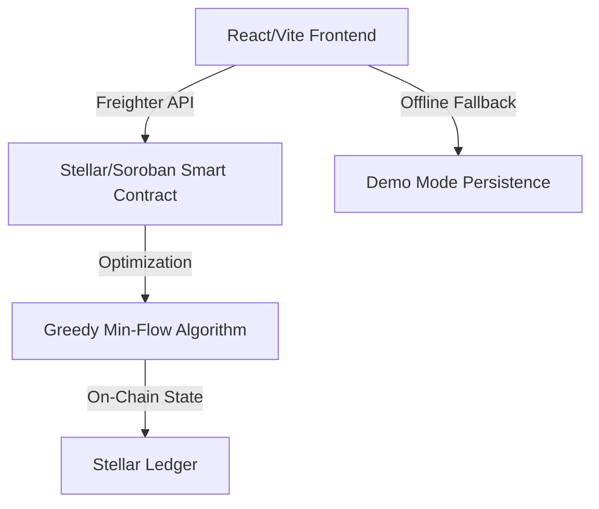
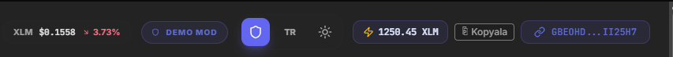
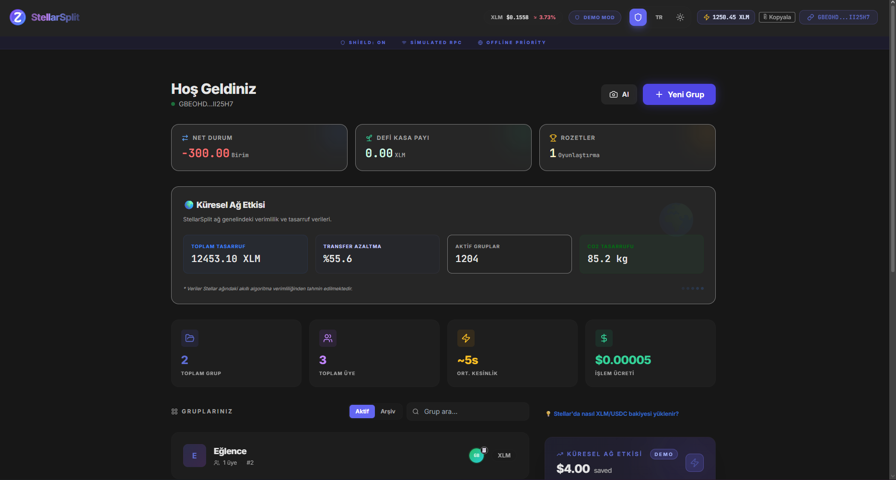
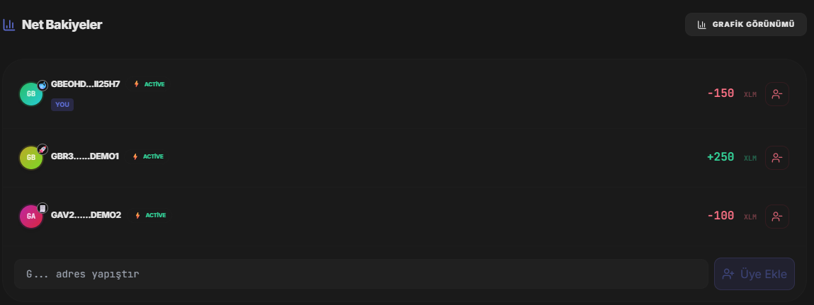
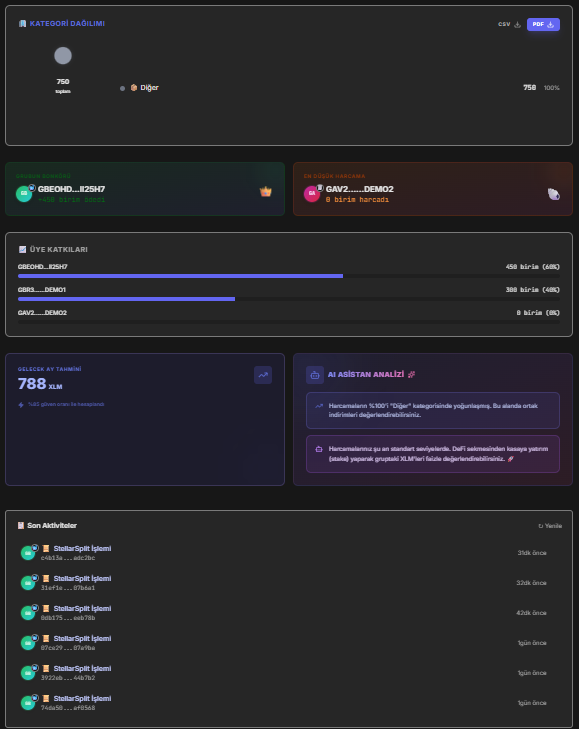

# StellarSplit ⚡

**Instant, Transparent, and Low-Fee Group Expense Settlements on Stellar.**

StellarSplit leverages Soroban smart contracts to solve the "who owes whom" problem in social circles, ensuring that debts are settled with the **absolute minimum number of transactions** while keeping fees virtually zero.

[](https://stellar.org)
[](https://soroban.stellar.org)
[](LICENSE)

---

## 🚀 The Problem & Solution

Traditional splitting apps rely on centralized databases and manual bank transfers that can be slow, costly, or prone to disputes.

**StellarSplit** changes the game:

- **Min-Transaction Logic**: Why make 10 transfers when 3 are enough? Our algorithm optimizes the debt graph on-chain.
- **Instant Finality**: Settlements occur in ~5 seconds with sub-penny fees ($0.00005).
- **Transparency**: Every group, expense, and settlement is immutable on the Stellar ledger.

---

## 🛠️ Architecture & Tech Stack



- **Frontend**: React 19, Vite 6, TypeScript, Tailwind CSS (Glassmorphism UI).
- **Smart Contracts**: Rust/Soroban with specialized storage patterns for gas efficiency.
- **Optimization**: Greedy debt-graph minimization (on-chain).
- **Reliability**: Integrated **Demo Mode** with mock network interception for unstable connections.

---

## 🧩 Key Features

- **🛡️ Demo Mode**: Toggle with `D` or via UI to experience the app even if Testnet is under stress.
- **📈 Impact Panel**: Real-time visualization of money saved compared to traditional banking systems.
- **🧬 Transaction Stepper**: Visual feedback for simulation, signing, and ledger submission phases.
- **🦴 Skeleton UI**: Professional loading states for smooth perceived performance.

---

## 🏗️ Technical Deep Dive

### Debt Optimization Algorithm

The contract implements a greedy algorithm to reduce settlement overhead:

1. Calculates net balance (Total Paid - Total Share) for each member.
2. Sorts members into Debtors and Creditors.
3. Greedily matches the largest Debtor with the largest Creditor.
4. Generates a list of direct transfers, minimizing the total transaction count.

### Gas Optimization

Used `Persistent` and `Temporary` storage strategies in Soroban to ensure that repetitive expense lookups are cost-effective while group metadata stays immutable.

---

## 🚦 Getting Started

### Prerequisites

- Node.js 20+, Rust, Stellar CLI.
- [Freighter Wallet](https://www.freighter.app/) (Testnet enabled).

### Run Locally

```bash
# 1. Clone & Install
git clone https://github.com/user/stellar-split
cd stellar-split/frontend
npm install

# 2. Environment (optional — defaults work for Testnet)
cp .env.example .env
# Edit .env if you use a custom contract or RPC.

# 3. Start Dev Server
npm run dev

# Run unit tests (after npm install)
npm run test:run

# Run E2E tests (Playwright; starts dev server automatically)
npm run e2e
# If you see EPERM on test-results, delete frontend/test-results/ and retry, or run from a terminal with write access.
```

**Test adresleri:** Grup oluştururken en az 2 üye gerekir. Kendi adresinize ek olarak kullanabileceğiniz testnet adresleri için bkz. [docs/TEST_ADDRESSES.md](docs/TEST_ADDRESSES.md).

### Backend (opsiyonel)

Analitik, webhook proxy veya OG görsel için `api` sunucusu:

```bash
cd api
npm install
npm start
```

- Adres: **http://localhost:3001**
- Health: **http://localhost:3001/health**

Frontend’in bu API’yi kullanması için `frontend/.env` içinde `VITE_ANALYTICS_ENDPOINT=http://localhost:3001/events` tanımlayın. Tanımlı değilse uygulama yine çalışır; backend zorunlu değildir.

### Mainnet

1. Deploy the Soroban contract to **mainnet** (e.g. `stellar contract deploy` or Stellar Laboratory).
2. In `frontend/.env` set mainnet values (see `.env.example`):
   - `VITE_CONTRACT_ID` = deployed contract ID
   - `VITE_SOROBAN_RPC_URL=https://rpc.mainnet.stellar.org`
   - `VITE_NETWORK_PASSPHRASE=Public Global Stellar Network ; September 2015`
   - `VITE_HORIZON_URL=https://horizon.stellar.org`
3. Optionally set `VITE_USDC_CONTRACT_ID` for mainnet USDC.
4. Build and deploy the frontend: `npm run build` then host the `dist/` output.

---

## 🔬 Demo / Mock Features

The following features are available in the UI but use **in-app or localStorage-only** implementations (no production backend). They are suitable for demos and can be extended later with real services:

| Feature                         | Location                                  | Current behavior                                                                                                                                                                                                                         |
| ------------------------------- | ----------------------------------------- | ---------------------------------------------------------------------------------------------------------------------------------------------------------------------------------------------------------------------------------------- |
| **Receipt storage**             | `frontend/src/lib/storage.ts`             | Pinata, Infura IPFS, or custom URL (env). Else: Base64.                                                                                                                                                                                  |
| **AI receipt scan**             | `frontend/src/lib/ai.ts`                  | With `VITE_OPENAI_API_KEY`: OpenAI Vision. Else: mock.                                                                                                                                                                                   |
| **DeFi / yield**                | `frontend/src/lib/defi.ts`                | Fixed APY + localStorage toggle (no on-chain DeFi).                                                                                                                                                                                      |
| **Social recovery / guardians** | Contract + `frontend/src/lib/recovery.ts` | Contract exposes `initiate_recovery` and `approve_recovery`. UI: guardian list and recovery state are still stored in localStorage (mock). To complete: persist guardians on-chain and wire the Security tab to contract recovery calls. |
| **Webhook notifications**       | `frontend/src/lib/notifications.ts`       | Sends payload via `fetch`; may hit CORS in browser; fallback logs a “Fictional Payload”.                                                                                                                                                 |

**Demo Mode** (toggle with `D` or UI): When enabled, all contract reads/writes are mocked in the frontend (no Soroban RPC or Freighter). Group and expense data are still written to localStorage for a consistent offline experience.

**Real integrations** are available: set `VITE_PINATA_JWT` for IPFS receipt uploads and/or `VITE_OPENAI_API_KEY` for AI receipt scanning. See [INTEGRATIONS.md](INTEGRATIONS.md) and `frontend/.env.example`.

---

## ✅ Mainnet checklist

When moving from Testnet to Mainnet:

1. **Deploy contract** — Build and deploy the Soroban contract to Mainnet; note the new contract ID.
2. **Set frontend env** — In `frontend/.env`: set `VITE_CONTRACT_ID`, `VITE_SOROBAN_RPC_URL` (e.g. `https://rpc.mainnet.stellar.org`), `VITE_NETWORK_PASSPHRASE` (Public Global Stellar Network), `VITE_HORIZON_URL` (e.g. `https://horizon.stellar.org`). Optionally set `VITE_USDC_CONTRACT_ID` for USDC settlements.
3. **Build & host** — Run `npm run build` in `frontend/` and serve the `dist/` output (e.g. Vercel, Netlify, or your own server).
4. **Domain & SSL** — Use HTTPS for the frontend and, if used, for the optional API (analytics/webhook proxy).
5. **Optional API** — If using the analytics API, set `WEBHOOK_TARGET` for the webhook proxy and point `VITE_ANALYTICS_ENDPOINT` to your API base URL + `/events`.

---

## 🛣️ Roadmap & Vision

- [x] **Multi-Token Support**: Settle in XLM (native) or USDC when `VITE_USDC_CONTRACT_ID` is set. Contract accepts any token address.
- [x] **QR Code / Stellar URI**: Pay link and "Cüzdanda Aç" open wallet; per-settlement QR in the Settle tab.
- [ ] **Social Recovery**: Contract has `initiate_recovery` / `approve_recovery`. UI guardian list and recovery state are mock (localStorage). Complete by persisting guardians on-chain and wiring the Security tab to these contract methods.

---

## 📋 Level 1 Gereksinimleri (Checklist)

| Gereksinim                     | Durum | Açıklama                                                                                                                                                                                                             |
| ------------------------------ | ----- | -------------------------------------------------------------------------------------------------------------------------------------------------------------------------------------------------------------------- |
| **1. Wallet kurulumu**         | ✅    | Freighter kullanılıyor; varsayılan ağ Stellar **Testnet** (`VITE_NETWORK_PASSPHRASE`, `horizon-testnet.stellar.org`, `soroban-testnet.stellar.org`).                                                                 |
| **2. Wallet bağlantısı**       | ✅    | Bağlan: `connectFreighter()` / "Cüzdanı Bağla" (`frontend/src/lib/stellar.ts`, `App.tsx`). Kes: `handleDisconnect()` ile adres temizlenir.                                                                           |
| **3. Bakiye işleme**           | ✅    | Bağlı cüzdanın XLM bakiyesi Horizon'dan çekilir (`useWalletBalance`), header'da `"X.XX XLM"` olarak gösterilir.                                                                                                      |
| **4. İşlem akışı**             | ✅    | Testnet üzerinde Soroban işlemleri (grup oluşturma, harcama ekleme, takas) gönderilir. Başarı/hata toast ile; geçmiş işlemler ve **işlem hash** `TxHistory` / `ActivityFeed` ve Stellar Expert linki ile gösterilir. |
| **5. Geliştirme standartları** | ✅    | UI (React/Vite), Freighter entegrasyonu, bakiye çekme, işlem mantığı (`contract.ts`), hata yönetimi (toast, `translateError`) mevcut.                                                                                |

---

## 📋 Level 2 Submission (Multi-wallet, Contract, Events)

| Gereksinim                        | Durum | Açıklama                                                                                                                                                                                 |
| --------------------------------- | ----- | ---------------------------------------------------------------------------------------------------------------------------------------------------------------------------------------- |
| **3 error types**                 | ✅    | **Rejected** (imza reddedildi), **Wallet not found** (cüzdan yok/bağlantı başarısız), **Insufficient balance** (yetersiz bakiye) — `frontend/src/lib/errors.ts`, toast ile gösteriliyor. |
| **Contract on testnet**           | ✅    | Aşağıdaki contract adresi Testnet’te deploy edilmiş.                                                                                                                                     |
| **Contract called from frontend** | ✅    | `create_group`, `add_expense`, `settle_group`, `get_group`, `get_expense`, `get_balances` vb. `frontend/src/lib/contract.ts` üzerinden çağrılıyor.                                       |
| **Transaction status visible**    | ✅    | TxHistory, ActivityFeed, başarı/hata toast’ları; işlem hash’i ve Stellar Expert linki gösteriliyor.                                                                                      |
| **Event listening**               | ✅    | `subscribeGroupEvents` (`frontend/src/lib/events.ts`) — grup sayfasında `expense_added`, `group_settled` vb. için polling ile state senkronizasyonu.                                     |
| **Min 2+ commits**                | ⚠️    | Repo’da anlamlı commit sayısı 2+ olmalı.                                                                                                                                                 |

### Deployed contract (Testnet)

- **Contract ID:** `CBQENHYCVSOK3CHZ6NRT6BI34W2ERPSRUNXHI6X5X33DTDCDWX27YN7K`
- **Network:** Stellar Testnet
- **Explorer:** [Stellar Expert (Testnet)](https://stellar.expert/explorer/testnet/contract/CBQENHYCVSOK3CHZ6NRT6BI34W2ERPSRUNXHI6X5X33DTDCDWX27YN7K)

### Örnek işlem hash’i (contract call)

- **Transaction hash:** `c4b13aaf245715d0ca8b1b721fb54043ec12eb097a91da384e7c89d381adc2bc`
- **Doğrulama:** [Stellar Expert Testnet – Transaction](https://stellar.expert/explorer/testnet/tx/c4b13aaf245715d0ca8b1b721fb54043ec12eb097a91da384e7c89d381adc2bc)

### Wallet options screenshot

README’deki **Screenshots** bölümünde “wallet options” için: Cüzdan bağlama ekranı (Freighter ile “Cüzdanı Bağla”) `docs/screenshots/01-wallet-connected.png` ile gösteriliyor. Birden fazla cüzdan seçeneği eklenirse ek ekran görüntüsü eklenebilir.

---

## 📸 Screenshots

### Wallet Connected & XLM Balance

Demo Mode active — wallet address (`GBEOHD...II25H7`) shown in header alongside live XLM balance (`1250.45 XLM`), real-time price ticker, and network status bar.

| Connected Wallet (header)                                     | Dashboard & Balance                                     |
| ------------------------------------------------------------- | ------------------------------------------------------- |
|  |  |

### Group Management & On-chain Settlements

Balance breakdown per member (you vs. demo members) and the Insights tab showing AI-powered spending analysis, member contribution bars, predictive forecasting, and on-chain activity feed with transaction hashes.

| Net Balances (Settle tab)                       | Insights, AI Analysis & Activity Feed                       |
| ----------------------------------------------- | ----------------------------------------------------------- |
|  |  |

---

## 👤 Submission Info

Created for the **Stellar/Soroban Hackathon**. Designed with ❤️ for the global financial ecosystem.

> "Making micro-transactions practically free, one group at a time."
