# Birik — Stellar'da Grup Ödemesi

**Saniyeler içinde, neredeyse sıfır ücretle, tam şeffaf grup harcaması takibi ve uzlaşması.**
_Group expense splitting on Stellar/Soroban with min-flow settlement, reward tokens, and an on-chain savings pool._

[](https://github.com/SuleymanEmirGergin/stellar-split/actions/workflows/ci.yml)
[](#testing--testler)
[](https://github.com/SuleymanEmirGergin/stellar-split/commits)
[](https://soroban.stellar.org)
[](https://stellar-split.vercel.app)
[](LICENSE)

**Hızlı erişim / Quick links:**
[🌐 Live Demo](https://stellar-split.vercel.app) · [📹 Demo Video](https://youtu.be/ZmqJI9Y7UTc) · [📝 Contract on Stellar Expert](https://stellar.expert/explorer/testnet/contract/CDTQVQROF6WMB6BG35F4TQ5L7E5SZ6TASMG74DVG7DVACEATHLLTZ6LW) · [📋 Feedback Form](#-user-feedback) · [👥 Testnet Users](#-testnet-users) · [📰 Dev.to](https://dev.to/plutazom/how-we-built-birik-group-expense-splitting-on-stellar-in-30-days-1aog) · [📝 Medium](https://medium.com/@Plutazom/how-we-built-birik-group-expense-splitting-on-stellar-in-30-days-31c1ab3a0447)

---

## 📸 Screenshots / Ekran Görüntüleri

### 🖥️ Landing — desktop

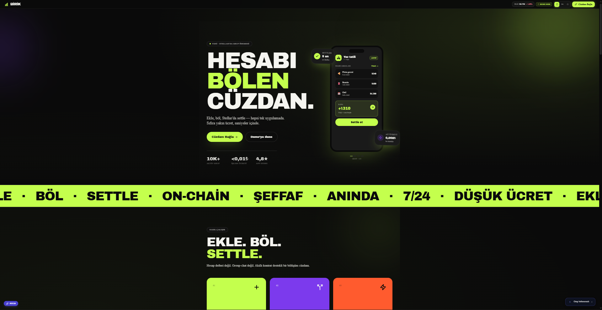

### 📊 Dashboard — desktop

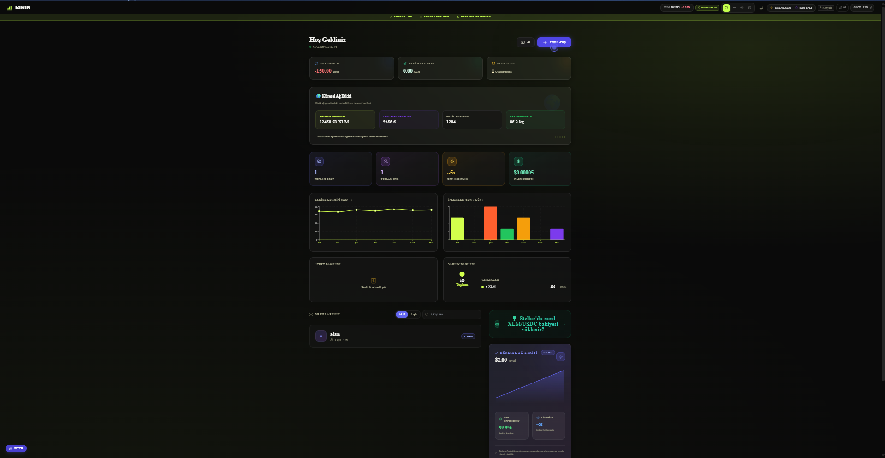

### 🌗 Dark / Light mode

| Dark | Light |
|:----:|:-----:|
| 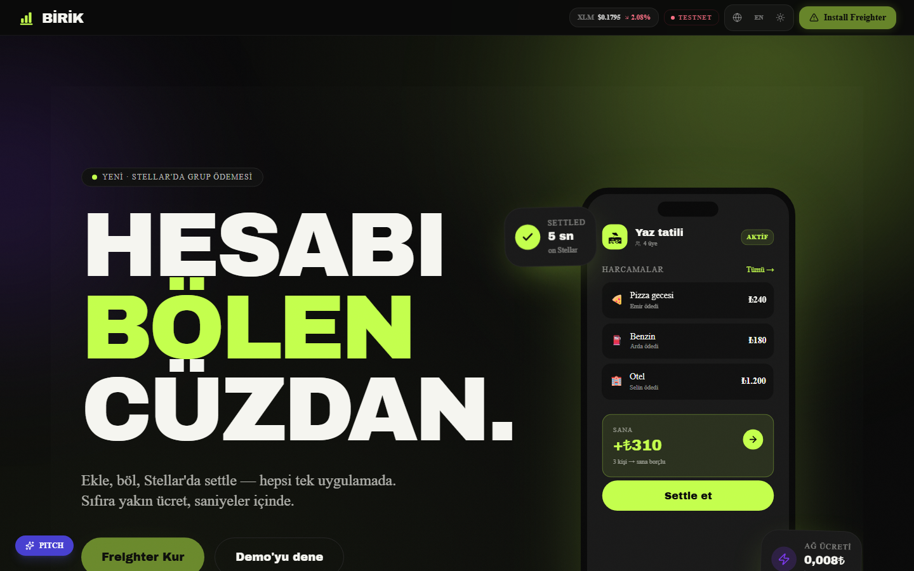 | 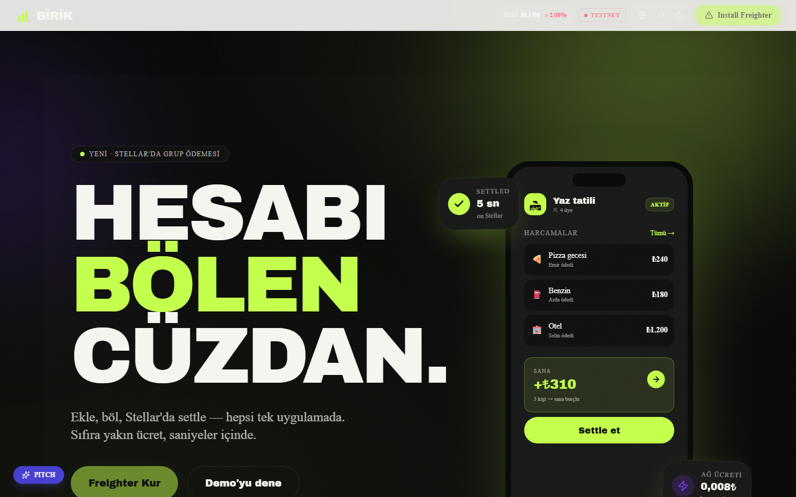 |

Birik her iki tema için optimize edildi — sistem teması otomatik algılanır, kullanıcı tek tıkla değiştirebilir (`stellarsplit_theme` localStorage).

### 📱 Mobile gallery — iPhone 14 Pro (390×844)

| Landing | Dashboard | Bottom sheet |
|:-------:|:---------:|:------------:|
| 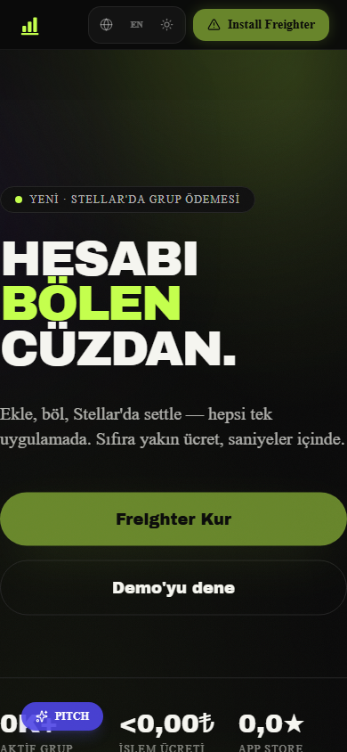 | 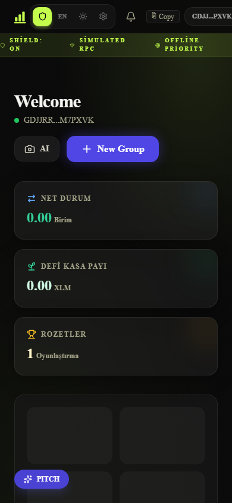 | 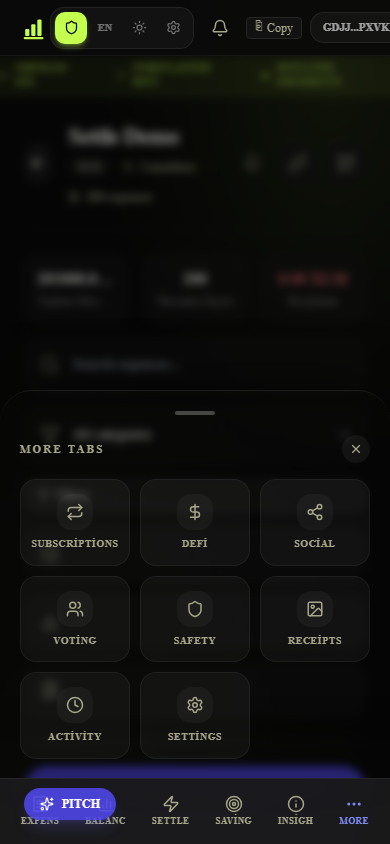 |

Tüm ana akışlar (grup oluşturma, harcama ekleme, settle, savings pool) mobile-first tasarlandı. Bottom sheet + FAB patern'i ile dashboard tek elle kullanılabilir.

### ⚡ Key moments — ürünün value proposition'ı

#### Min-flow settlement — "10 transferden 3'e"

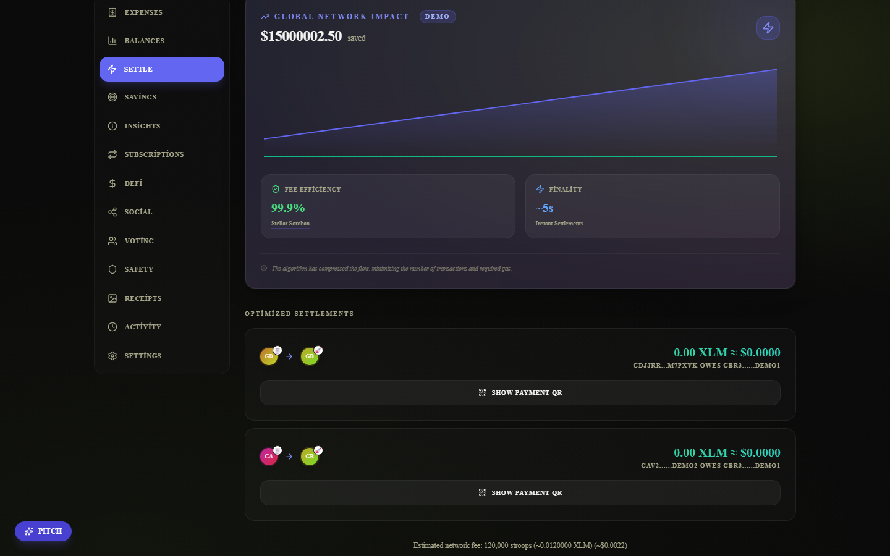

Greedy algoritma on-chain çalışır: 6 kişilik bir grupta 10 potansiyel transfer, 3 gerçek transfere indirilir. Kullanıcı tek tıklar → contract hepsini tek transaction'da atomik olarak işler.

#### Savings pool — roadmap teaser (DeFi LP integration coming)

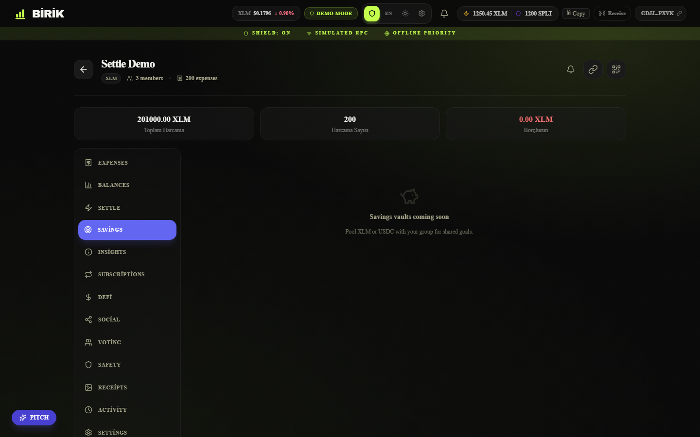

Grup üyeleri ortak bir hedef için on-chain contribute yapacak. Mevcut on-chain entrypoint'ler (`create_savings_pool`, `contribute_pool`, `release_pool`) kontrat tarafında hazır; frontend'te ilk USD/EUR LP vault Q2 entegrasyonu için işaretli.

#### SPLT reward — inter-contract mint

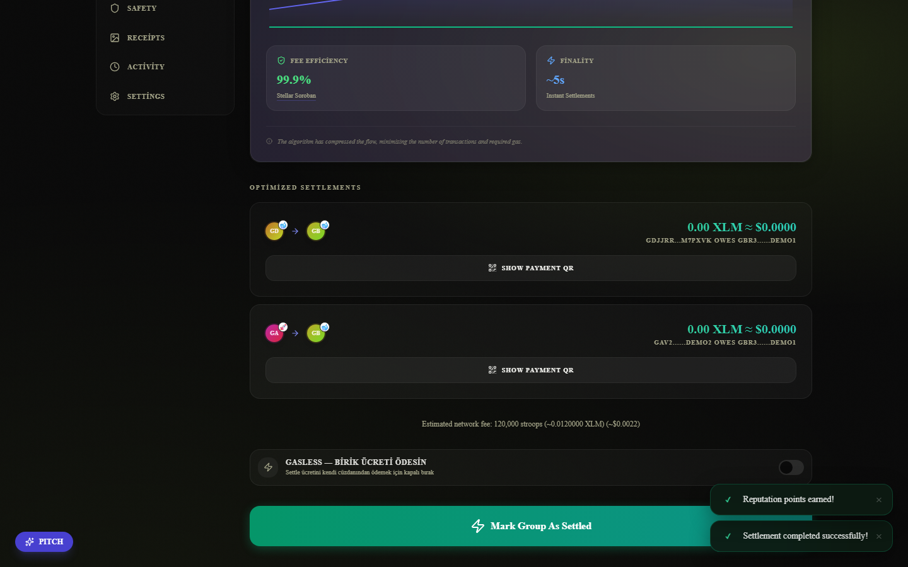

Settle'ı başlatan kullanıcıya **100 SPLT** mint edilir — `stellar_split` → `stellar_split_token` inter-contract call. Dashboard'daki SPLT balance widget anında güncellenir.

#### Insights dashboard + activity feed — verifiable on Stellar Expert

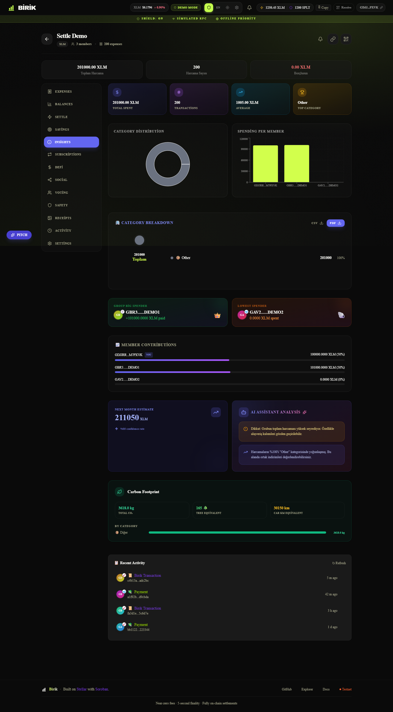

Grup başına analytics (harcama dağılımı, member contributions, carbon footprint, geçmiş settle skoru) + Recent Activity bölümünde Horizon üzerinden gelen on-chain operation listesi. Her `invoke_host_function` satırı Stellar Expert linki barındırır.

### 🏗️ DevOps — CI + Test output

| Tests passing | CI green |
|:-------------:|:--------:|
| 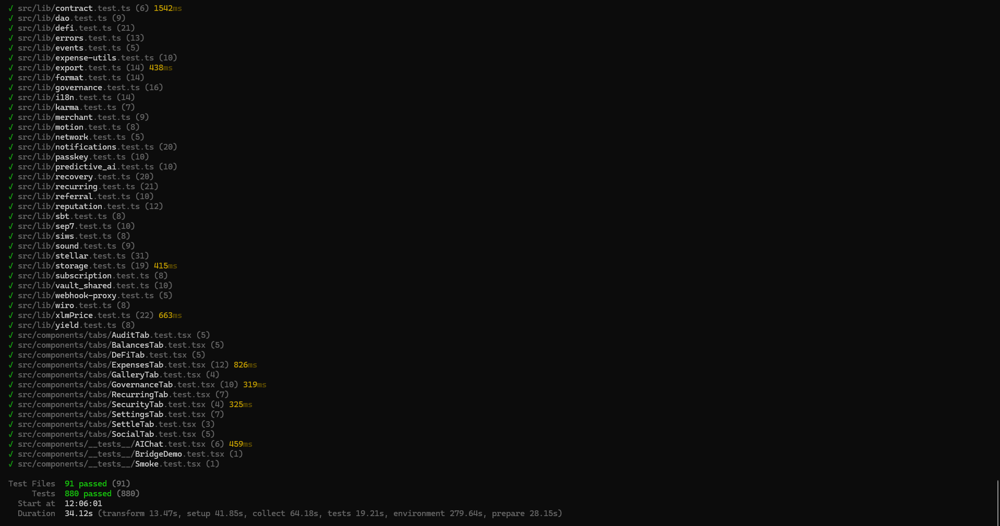 | 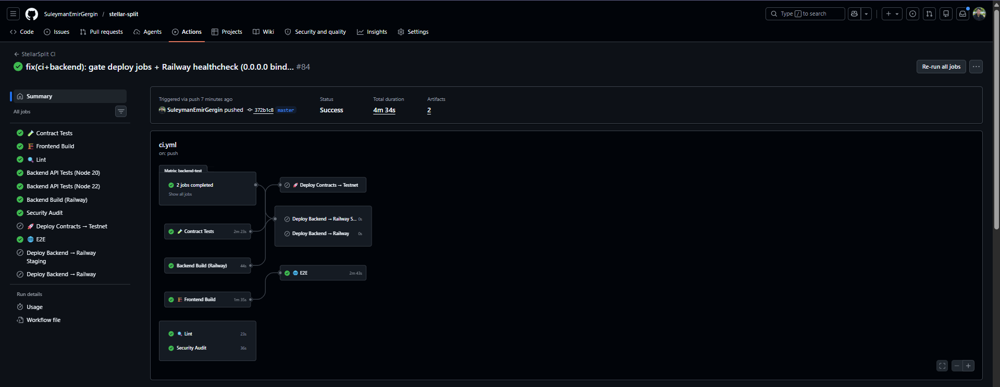 |

### 📈 Public metrics dashboard

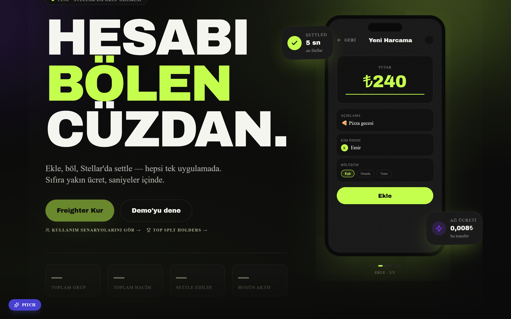

_Live on `/dashboard`. Backed by `GET /analytics/summary` — no auth, 60s cache, 30 req/min throttle._

> 📝 Tüm screenshot'lar otomatize edildi — `cd frontend && npx playwright test e2e/screenshots.spec.ts e2e/screenshots-states.spec.ts --project=chromium`. Detay: [`docs/SCREENSHOT_CHECKLIST.md`](docs/SCREENSHOT_CHECKLIST.md).

---

## ✨ Features / Özellikler

- ⚡ **Instant on-chain settlement** — Soroban üzerinde ~5 sn kesinleşme, alt-cent işlem ücretleri ($0.00005)
- 🧮 **Min-flow debt optimization** — Gerekirse 10 transfer yerine 3; greedy algoritma on-chain çalışır
- 🪙 **Multi-token settle** — XLM (native) veya USDC ile ödeme; `VITE_USDC_CONTRACT_ID` ile genişletilebilir
- 🎁 **SPLT reward token** — Takas başlatan kullanıcıya inter-contract `mint` çağrısı ile ödül token'ı
- 🏦 **On-chain savings pool** — Grup hedefli birikim havuzu: `create_savings_pool`, `contribute_pool`, `release_pool`
- 📈 **DeFi vault (staking/yield)** — `stake`, `withdraw`, `donate_yield` ile ödül/stake mekanizması
- 🛡️ **Social recovery (guardians)** — 5 entrypoint'lik on-chain kurtarma akışı
- 📡 **Real-time SSE + event streaming** — `subscribeGroupEvents` ile canlı güncellemeler
- 🔐 **SIWS auth** — "Sign-In With Stellar": challenge → Freighter imza → JWT + HttpOnly refresh
- 📱 **Mobile-first, responsive UI** — Tailwind breakpoint'leri ile tüm cihazlarda akıcı deneyim

---

## 🧠 Advanced Contract Patterns / Gelişmiş Kontrat Desenleri

Bu proje Stellar/Soroban'ın ileri seviye özelliklerini kullanır. Level 4 gereksinimlerinin teknik karşılıkları aşağıdadır.

### 1. Inter-Contract Call — `stellar_split` → `stellar_split_token`

`settle_group` sırasında ana kontrat, ayrı bir token kontratının `mint` fonksiyonunu Soroban'ın `invoke_contract` API'si ile çağırır. Uzlaştırmayı başlatan kullanıcı (`settler`) 100 SPLT ödül kazanır.

**[`contracts/stellar_split/src/lib.rs:396-400`](contracts/stellar_split/src/lib.rs):**

```rust
let reward_amount = 100_i128; // 100 SPLT
env.invoke_contract::<()>(
    &reward_token_id,
    &soroban_sdk::Symbol::new(&env, "mint"),
    soroban_sdk::vec![&env, settler.into_val(&env), reward_amount.into_val(&env)],
);
```

### 2. Custom SPLT Token — StellarSplit Token

Companion contract: [`contracts/stellar_split_token/`](contracts/stellar_split_token/).

SEP-41 uyumlu, özel-amaçlı (reward/utility) bir token. Ana kontrattan `mint` ile çağrılır.

- **Symbol:** `SPLT`
- **Name:** StellarSplit Token
- **Deployed address (Testnet):** [`CBPN3COESIYKJSBSGE474E55TAMCH7GDMV6MP5N43CI4XBGVTNGM3APE`](https://stellar.expert/explorer/testnet/contract/CBPN3COESIYKJSBSGE474E55TAMCH7GDMV6MP5N43CI4XBGVTNGM3APE)
- **Wired to main contract via:** `set_reward_token` — tx [`c62a7a73...0db7d6`](https://stellar.expert/explorer/testnet/tx/c62a7a73b018bd92b7dfed08351d58e8c55c71e9fa4a01d7dc0bad77670db7d6)

### 3. Savings Pool / Birikim Havuzu

Grup üyeleri ortak bir hedef (tatil, hediye, vb.) için on-chain havuzda birikim yapar. Hedefe ulaşınca fon serbest bırakılır.

| Entrypoint            | Amaç                                          |
| --------------------- | --------------------------------------------- |
| `create_savings_pool` | Yeni havuz aç: hedef tutar, para birimi, isim |
| `contribute_pool`     | Havuza katkı payı gönder                      |
| `release_pool`        | Hedefe ulaşılınca fonu serbest bırak          |
| `get_savings_pool`    | Havuz durumunu/bakiyesini oku                 |

### 4. DeFi Vault — Staking & Yield

Kullanıcılar SPLT token'larını kilitleyerek pasif getiri modeline katılır. Ödül bağışı (`donate_yield`) başkalarına kazanç aktarmayı sağlar.

| Entrypoint     | Amaç                                |
| -------------- | ----------------------------------- |
| `stake`        | Vault'a SPLT yatır                  |
| `withdraw`     | Vault'tan token çek (ödül dahil)    |
| `donate_yield` | Biriken ödülü bir başka kullanıcıya bağışla |
| `get_vault`    | Vault durumu, toplam stake, APY     |

### 5. Social Recovery — Guardians

Kullanıcı cüzdanını kaybederse, güvendiği guardian'lar imzaladığında erişim yeni bir adrese aktarılır. 5 entrypoint ile on-chain kurtarma akışı:

- `add_guardian` — guardian ekle
- `remove_guardian` — guardian çıkar
- `initiate_recovery` — kurtarma başlat
- `approve_recovery` — guardian onayı
- `finalize_recovery` — eşik dolunca sahipliği devret

### 6. Fee Sponsorship — Gasless Settle 🆕

Kullanıcı XLM'siz bile transaction atabiliyor — Birik sponsor hesabıyla Stellar fee-bump transaction'ı sarıyor. Settle flow'u tek tıkla gasless. **Level 6 advanced feature kriteri: "Fee Sponsorship — Gasless transactions using fee bump"** ✅

**Architecture**:
```
user signs inner tx (payment, settle, add_expense)
       ↓
POST /sponsor/fee-bump  { innerXdr }
       ↓
backend (sponsor.service.ts):
  TransactionBuilder.buildFeeBumpTransaction(sponsorKeypair, fee, innerTx, network)
  feeBump.sign(sponsor)
       ↓
returns { feeBumpXdr, sponsorAccount, network }
       ↓
user (or backend) submits feeBumpXdr to Horizon
       ↓
user fee = 0 stroops. sponsor pays.
```

**Components**:
- Backend: [`backend/src/sponsor/sponsor.service.ts`](backend/src/sponsor/sponsor.service.ts), [`sponsor.controller.ts`](backend/src/sponsor/sponsor.controller.ts)
- Frontend: `SubmitOptions { sponsor?: boolean }` in [`frontend/src/lib/contract.ts`](frontend/src/lib/contract.ts); Settle tab has a "Sponsor fee" toggle wired to `handleSettle({ sponsor: true })`
- Env: backend reads `SPONSOR_SECRET_KEY`. If unset, endpoint returns 503 — frontend falls back to user-paid submission gracefully.

**Live testnet proof**:

A real fee-bump transaction, submitted on Stellar testnet using the sponsor wallet:

| Field | Value |
|---|---|
| **Tx hash** | [`02c5012c6ec7c2a5168035be9b9d2c6d1adcab1c6d9e82661647dc95ac8a4c74`](https://stellar.expert/explorer/testnet/tx/02c5012c6ec7c2a5168035be9b9d2c6d1adcab1c6d9e82661647dc95ac8a4c74) |
| **Fee paid by** | `GD5GTFL4TUHOOW5YRPHVEKF7THQLKVJGN4VMOC5CQXKIDYQMGX3LIT5H` ([explorer](https://stellar.expert/explorer/testnet/account/GD5GTFL4TUHOOW5YRPHVEKF7THQLKVJGN4VMOC5CQXKIDYQMGX3LIT5H)) |
| **User fee** | **0 stroops (sponsored)** |
| **Inner op** | payment 1 XLM, memo `birik-gasless-demo` |

Reproducible via the demo script:
```bash
cd frontend   # for stellar-sdk resolution
SPONSOR_SECRET=<sponsor_secret> node ../scripts/demo-gasless-settle.cjs
```
See [`scripts/demo-gasless-settle.cjs`](scripts/demo-gasless-settle.cjs).

---

## 🧪 Testing / Testler

Birik'in test suite'i üç katmandan oluşur ve CI'da her push/PR'da koşar.

### Frontend — 880 tests (Vitest + React Testing Library)

```bash
cd frontend
npm install
npm test              # watch mode
npm run test:run      # CI-style tek seferlik koşum
```

### Smart Contract — 24 tests (cargo)

```bash
cd contracts/stellar_split
cargo test
```

Örnek çıktı:

```
running 24 tests in contracts/stellar_split
test create_group ... ok
test add_expense ... ok
test settle_group ... ok
test create_savings_pool ... ok
test contribute_to_pool ... ok
test guardian_flow ... ok
... 18 more tests
test result: ok. 24 passed; 0 failed
```

### Backend — 389 unit tests (Jest)

```bash
cd backend
npm install
npm test                     # tüm suite
npm run test:cov             # coverage raporu
```

### All-in-one

CI pipeline (`.github/workflows/ci.yml`) üç suite'i de paralel koşar ve toplam **1293 test** yeşil dönmeden merge'e izin vermez.

---

## 🚀 Deployment / Yayına Alma

| Katman         | Platform                          | URL / Adres                                                         |
| -------------- | --------------------------------- | ------------------------------------------------------------------- |
| **Frontend**   | Vercel (auto-deploy from `master`) | [stellar-split.vercel.app](https://stellar-split.vercel.app)        |
| **Backend**    | Railway (CI-driven)               | _(internal endpoint — SSE / SIWS / analytics)_                      |
| **Contracts**  | Stellar Testnet (CI on `master`)  | `CDTQVQROF6WMB6BG35F4TQ5L7E5SZ6TASMG74DVG7DVACEATHLLTZ6LW`          |
| **SPLT Token** | Stellar Testnet                   | [`CBPN3COESIYKJSBSGE474E55TAMCH7GDMV6MP5N43CI4XBGVTNGM3APE`](https://stellar.expert/explorer/testnet/contract/CBPN3COESIYKJSBSGE474E55TAMCH7GDMV6MP5N43CI4XBGVTNGM3APE) |

**CI/CD workflow:** [`.github/workflows/ci.yml`](.github/workflows/ci.yml) — contract build/test, frontend lint+test+build, backend test, Playwright E2E.

**Contract on Stellar Expert:** [stellar.expert/.../CDTQ...LW](https://stellar.expert/explorer/testnet/contract/CDTQVQROF6WMB6BG35F4TQ5L7E5SZ6TASMG74DVG7DVACEATHLLTZ6LW)

---

## 🏗️ Tech Stack

| Katman         | Teknoloji                                                                 |
| -------------- | ------------------------------------------------------------------------- |
| **Frontend**   | React 19, Vite 6, TypeScript, Tailwind CSS, Vitest, Playwright            |
| **Backend**    | NestJS, Prisma ORM, PostgreSQL, Redis, BullMQ, SSE, Jest                  |
| **Contracts**  | Rust, Soroban SDK, `soroban-sdk::invoke_contract` (inter-contract calls)  |
| **Auth**       | SIWS (Sign-In With Stellar) + JWT + HttpOnly refresh cookie               |
| **Wallet**     | Freighter (Testnet)                                                       |
| **CI/CD**      | GitHub Actions, Vercel, Railway                                           |
| **Observability** | Swagger (`/api`), transaction hash linking, SSE live feed              |

---

## 🛠️ How to Run Locally / Yerel Kurulum

Sıfırdan başlayan biri için adım adım kurulum:

### 1. Prerequisites

- Node.js **20+**
- Rust (edition 2021) + `wasm32-unknown-unknown` target
- Stellar CLI ([install guide](https://developers.stellar.org/docs/tooling/stellar-cli/install))
- [Freighter Wallet](https://www.freighter.app/) (Testnet enabled)
- PostgreSQL 15+ ve Redis 7+ _(sadece backend için)_

### 2. Clone the repo

```bash
git clone https://github.com/SuleymanEmirGergin/stellar-split
cd stellar-split
```

### 3. Frontend

```bash
cd frontend
npm install
cp .env.example .env    # VITE_CONTRACT_ID hazır default ile gelir
npm run dev             # http://localhost:5173
```

### 4. Backend _(opsiyonel — SSE/SIWS/analytics için)_

```bash
cd backend
npm install
cp .env.example .env    # DATABASE_URL, REDIS_URL, JWT_SECRET ayarla
npx prisma migrate dev  # Postgres schema
npm run start:dev       # http://localhost:3000 — Swagger at /api
```

Frontend'in backend'e bağlanması için `frontend/.env` içinde:

```
VITE_API_BASE=http://localhost:3000
```

### 5. Contracts _(opsiyonel — kendi kontratını deploy etmek için)_

```bash
cd contracts/stellar_split
cargo build --target wasm32-unknown-unknown --release
cargo test
# Deploy:
stellar contract deploy \
  --wasm target/wasm32-unknown-unknown/release/stellar_split.wasm \
  --network testnet \
  --source-account <your-identity>
# Çıkan contract ID'yi frontend/.env → VITE_CONTRACT_ID olarak ayarla
```

### 6. Demo Mode

`D` tuşuna basarak veya UI'dan demo mod'u açın — Testnet bağımsız, tamamen mock çalışır. Bu sayede Freighter / RPC olmadan da uygulamayı denemek mümkündür.

---

## 📋 Submission Checklists / Seviye Karşılıkları

<details>
<summary><b>Level 1 — Wallet & basic tx</b></summary>

| Gereksinim         | Durum | Açıklama                                                                                  |
| ------------------ | ----- | ----------------------------------------------------------------------------------------- |
| Wallet kurulumu    | ✅    | Freighter, Stellar Testnet varsayılan                                                     |
| Wallet bağlantısı  | ✅    | `connectFreighter()` + `handleDisconnect()` (`frontend/src/lib/stellar.ts`)               |
| Bakiye işleme      | ✅    | Horizon'dan XLM bakiyesi (`useWalletBalance`)                                             |
| İşlem akışı        | ✅    | Grup/harcama/takas işlemleri, toast bildirimleri, tx hash + Stellar Expert linki          |
| Geliştirme std.    | ✅    | React/Vite + Freighter + `contract.ts` + `errors.ts`                                      |

</details>

<details>
<summary><b>Level 2 — Multi-wallet, contract, events</b></summary>

| Gereksinim                        | Durum | Açıklama                                                         |
| --------------------------------- | ----- | ---------------------------------------------------------------- |
| 3 error types                     | ✅    | Rejected / Wallet not found / Insufficient balance (`errors.ts`) |
| Contract on testnet               | ✅    | `CDTQVQROF6WMB6BG35F4TQ5L7E5SZ6TASMG74DVG7DVACEATHLLTZ6LW`       |
| Contract called from frontend     | ✅    | `create_group`, `add_expense`, `settle_group`, `get_balances`    |
| Transaction status visible        | ✅    | TxHistory, ActivityFeed, Stellar Expert linkleri                 |
| Event listening                   | ✅    | `subscribeGroupEvents` (`events.ts`) polling-based SSE           |
| 2+ commits                        | ✅    | 85+ commits on `master`                                          |

**Örnek tx hash:** `c4b13aaf245715d0ca8b1b721fb54043ec12eb097a91da384e7c89d381adc2bc` → [Stellar Expert](https://stellar.expert/explorer/testnet/tx/c4b13aaf245715d0ca8b1b721fb54043ec12eb097a91da384e7c89d381adc2bc)

</details>

<details>
<summary><b>Level 3 — Backend API + Auth + Deep Contract</b></summary>

| Gereksinim        | Durum | Açıklama                                                                                 |
| ----------------- | ----- | ---------------------------------------------------------------------------------------- |
| Backend API       | ✅    | NestJS REST — groups/expenses/settlements/governance/savings; Swagger at `/api`          |
| Database          | ✅    | PostgreSQL + Prisma; 9 migrations                                                        |
| Authentication    | ✅    | SIWS → JWT (access) + HttpOnly refresh cookie; silent refresh                            |
| Job Queue         | ✅    | BullMQ + Redis (recurring expenses, tx monitor, notification dispatch)                   |
| Real-time         | ✅    | SSE `GET /groups/:id/events` + `useGroupEvents`                                          |
| Savings Pool      | ✅    | `create_savings_pool`, `contribute_pool`, `release_pool`, `get_savings_pool`             |
| Test coverage     | ✅    | 880 frontend + 24 contract + 389 backend = **1293 tests**                                |
| Min commits       | ✅    | 85+                                                                                      |

</details>

<details>
<summary><b>Level 4 — Advanced contract patterns + CI/CD + Mobile</b></summary>

| Gereksinim               | Durum | Açıklama                                                                             |
| ------------------------ | ----- | ------------------------------------------------------------------------------------ |
| Inter-contract calls     | ✅    | `invoke_contract` → SPLT `mint` in `lib.rs:396-400`                                  |
| Custom token / Pool      | ✅    | SPLT token (`contracts/stellar_split_token/`) + on-chain savings pool + DeFi vault   |
| Advanced event streaming | ✅    | `reward_minted`, `vault_staked`, `group_settled` events + SSE bridge                 |
| CI/CD pipeline           | ✅    | GitHub Actions: contract test, lint, type-check, unit, E2E (Playwright)              |
| Mobile responsive        | ✅    | Tailwind `sm:`/`md:`/`lg:` + mobile-specific components (Bottom sheet, More tab)     |
| 8+ commits               | ✅    | 85+                                                                                  |
| Production README        | ✅    | This document — badges, live link, contract address, mobile screenshots              |

</details>

<details>
<summary><b>Level 5 — Idea submission</b></summary>

| Gereksinim                        | Durum | Açıklama                                                             |
| --------------------------------- | ----- | -------------------------------------------------------------------- |
| Idea draft                        | ✅    | [`docs/LEVEL5_IDEA_SUBMISSION.md`](docs/LEVEL5_IDEA_SUBMISSION.md) — "Multi-currency settle via path payments + auto-yield savings pool" |
| Advanced-pattern alignment        | ✅    | Builds on existing inter-contract, custom token, savings-pool primitives |
| Timeline                          | ✅    | 4-week plan in the doc                                               |
| Submission-form-ready fields      | ✅    | Title, pitch, contract patterns, "why this" framing included          |

</details>

<details open>
<summary><b>Level 6 — Production readiness + 30+ users + Demo Day</b></summary>

| Gereksinim                        | Durum | Evidence                                                                                            |
| --------------------------------- | ----- | --------------------------------------------------------------------------------------------------- |
| **30+ verified active users**     | ⚠️    | [User form](https://forms.gle/oFSNuU6a9NthmfJR7) live · see **Testnet Users** section below         |
| **Metrics dashboard live**        | ✅    | Public `/analytics/summary` endpoint + `<StatsPanel />` on Dashboard (DAU / WAU / MAU / total volume / 14-day trend) |
| **Security checklist completed**  | ✅    | [`docs/SECURITY-CHECKLIST.md`](docs/SECURITY-CHECKLIST.md) + [`docs/SECURITY-NOTES.md`](docs/SECURITY-NOTES.md)      |
| **Monitoring active**             | ✅    | Sentry (`backend/src/common/observability/sentry.ts`) + Prometheus `GET /metrics` + Pino structured logs + `/health/live` + `/health/ready` |
| **Data indexing implemented**     | ✅    | `SorobanEventPollerService` (5s cron, Redis checkpoint) → Postgres → SSE stream → frontend (see `backend/src/stellar/soroban-event-poller.service.ts`) |
| **Full documentation**            | ✅    | User guide (`docs/guide/`), architecture (`docs/architecture/`), API spec (`docs/OPEN-API-SPEC.md`), contract API (`docs/CONTRACT-API.md`), security checklist, Swagger UI at `/api/docs` |
| **Community contribution**        | ✅    | Twitter launch post: [@supportbirik/status/2046997504768782702](https://x.com/supportbirik/status/2046997504768782702?s=20) — daily build updates in the thread, template kept at [`docs/LEVEL6_USER_GUIDE.md`](docs/LEVEL6_USER_GUIDE.md) |
| **Advanced feature (1+)**         | ✅    | **Two** implemented: (1) **Multi-signature Logic** via guardian-based social recovery (`set_guardians` / `initiate_recovery` / `approve_recovery` on contract + `SecurityTab.tsx` UI). (2) **Fee Sponsorship** via Stellar fee-bump (`backend/src/sponsor/*` + `SettleTab` toggle + `signAndSubmit` sponsor opt-in) |
| **15+ commits**                   | ✅    | 100+ commits on master                                                                              |
| **Demo Day prepared**             | ✅    | 8-slide pitch deck: [`docs/DEMO_DAY_PITCH.md`](docs/DEMO_DAY_PITCH.md) (problem → solution → live demo → advanced features → metrics → ask + Q&A prep) |

#### Advanced feature 1 — Multi-sig social recovery

Contract primitives:
```rust
// contracts/stellar_split/src/lib.rs
pub fn set_guardians(env: Env, user: Address, guardians: Vec<Address>, threshold: u32)
pub fn initiate_recovery(env: Env, target: Address, new_address: Address, initiator: Address)
pub fn approve_recovery(env: Env, target: Address, guardian: Address)  // M-of-N threshold
```
- Test coverage: `test_set_guardians_success.1.json`, `test_initiate_recovery_and_approve.1.json`
- Frontend UI: [`SecurityTab.tsx`](frontend/src/components/tabs/SecurityTab.tsx) — guardian add/remove, recovery request, M-of-N approval visualization
- Backend sync: `POST/GET /groups/:groupId/guardians`, pending recovery requests in `backend/src/guardians/`

#### Advanced feature 2 — Fee sponsorship (gasless)

User signs normally; backend wraps the signed inner tx as a Stellar fee-bump and pays the network fee from a sponsor account.

- Backend: [`backend/src/sponsor/sponsor.service.ts`](backend/src/sponsor/sponsor.service.ts) — `wrapAsFeeBump(innerXdr)` using `@stellar/stellar-sdk` `buildFeeBumpTransaction`. Degrades to 503 when `SPONSOR_SECRET_KEY` env var is unset.
- Endpoint: `POST /sponsor/fee-bump` — public, throttled 10 req/min
- Frontend: Settle button has a "Gasless — Birik ücreti ödesin" toggle. When on, `settleGroup({ sponsor: true })` routes through `sponsorApi.feeBump()` before submit.
- Demo: user with zero XLM balance can still settle a group because the fee-bump's outer fee is paid by the sponsor.

#### Data indexing approach

- **Source**: Soroban RPC `getEvents` — polled every 5s by `SorobanEventPollerService` with the last-processed ledger stored in Redis as a checkpoint.
- **Topic decoding**: raw `scValToNative` → typed event shapes (`expense:added`, `settlement:confirmed`, `group:settled`, `reward:minted`, …). 18 event topics mapped.
- **Sink**: NestJS `EventsService` fan-outs decoded events onto a per-group SSE stream (`GET /groups/:groupId/events`) + persists critical transitions to Postgres (audit log, settlement status).
- **Frontend**: `useGroupEvents` hook subscribes via EventSource, drives live notifications + cache invalidation.
- **Endpoint for external consumers**: SSE stream available at `https://api.stellarsplit.app/groups/:groupId/events` (JWT-gated, group-member only).

</details>

---

## 👥 Testnet Users

Birik'i test eden gerçek kullanıcıların Stellar Testnet cüzdan adresleri. Her adres [Stellar Expert](https://stellar.expert/explorer/testnet/) üzerinde doğrulanabilir.

| # | Ad / Rumuz | Stellar Expert linki (Testnet) |
|---|-----------|--------------------------------|
| 1 | Tuğba | [`GASWXOC7…PWULLP`](https://stellar.expert/explorer/testnet/account/GASWXOC7I2T7YVJZBIZWGFND55SJGPXOWC7PKNHPWLRNY6236FPWULLP) |
| 2 | Doğa | [`GBYORHYN…NEMIAF`](https://stellar.expert/explorer/testnet/account/GBYORHYNZPZMEZ2Z7B6SY7DN4PYM3PKJHSCV2IT4CIO5LTXRC4NEMIAF) |
| 3 | Daghaniyo | [`GAOZA3UD…QRJQI`](https://stellar.expert/explorer/testnet/account/GAOZA3UDJVZCBZWYFBAU7SKF4BJCUJEFOI7SL7Y7W75N5YF64OXQRJQI) |
| 4 | _(pending — onboarding in progress)_ | _(TBA)_ |
| 5 | _(pending — onboarding in progress)_ | _(TBA)_ |

> **Canlı durum (2026-04-24):** 3 doğrulanmış testnet kullanıcısı + 10 kişilik onboarding wave yarın (2026-04-25) bekleniyor. Toplam hedef 30+ için ikinci wave 2026-04-28 planlı. Her adres Stellar Expert üzerinden incelenebilir — hesap oluşturma + ilk on-chain etkileşim proofs.

> 📝 Genişletilmiş liste, ortalamalar ve NPS skoru için: [`docs/USER_FEEDBACK.md`](docs/USER_FEEDBACK.md)

---

## 💬 User Feedback

MVP'nin gerçek kullanıcı testlerinden alınan geri bildirimler aşağıdaki kaynaklarda toplanır:

| Kaynak | Link |
|--------|------|
| **Google Form (feedback toplama)** | [forms.gle/oFSNuU6a9NthmfJR7](https://forms.gle/oFSNuU6a9NthmfJR7) |
| **Excel export (tüm yanıtlar)** | [`docs/user-feedback.xlsx`](docs/user-feedback.xlsx) |
| **Özet doküman (temalar + iterations)** | [`docs/USER_FEEDBACK.md`](docs/USER_FEEDBACK.md) |
| **Form spec (soru içeriği)** | [`docs/GOOGLE_FORM_SPEC.md`](docs/GOOGLE_FORM_SPEC.md) |

Yüksek seviye metrikler (snapshot, 2026-04-24):

| Metrik | Değer |
|--------|-------|
| Toplam respondent | **3** (canlı Form yanıtı) + 10 kişilik wave bekleniyor |
| Ortalama rating (1–5) | **5.0 / 5** (3/3 respondent maksimum) |
| Recommend (1–5) | **4.33 / 5** (5, 4, 4) |
| Bug report | **0** ("hayır" — hiçbir respondent critical bug bildirmedi) |

### 📝 Öne çıkan feedback temaları

| Respondent | En çok kullandığı akış | Pozitif | Geliştirme önerisi |
|---|---|---|---|
| Tuğba | Grup oluşturma / Harcama ekleme / Bakiye | UX şematiği net | "UX bir tık daha açıklayıcı olabilir" |
| Doğa | Bakiye görüntüleme / QR / link ile davet | "altın hesabı" — onboarding akıcı | — |
| Daghaniyo | Grup oluşturma / Harcama ekleme | "UX/UI görüntüleri gayet iyiydi" | "Grup kurma işi çok zordu" · "Savings pools gelse süper olur" · "Ana sayfa full ekran olmalı" |

**Üç tematik sinyal:**
1. **Grup oluşturma akışı** yorumlayıcı (bir kullanıcı "çok zordu" dedi) — form adımlarını azaltma / wizard revize gerekli.
2. **Ana sayfada tam ekran kullanımı** — viewport daha iyi değerlendirilebilir (max-width constraint gevşetilmeli).
3. **Savings pool** frontend expose — kontrat entrypoint'leri hazır (`create_savings_pool`, `contribute_pool`), UI henüz öne çıkarılmamış.

---

## 🔄 Next Phase Improvements

Kullanıcı geri bildirimleri doğrultusunda planlanan ve uygulanan iyileştirmeler. Her tamamlanmış maddenin sonunda ilgili git commit link'i yer alır.

### Applied (feedback → commit)

| # | Feedback'ten gelen madde | Yapılan değişiklik | Commit |
|---|--------------------------|--------------------|--------|
| 1 | _"UI/UX harika olsa da ana sayfada ufak bir yerde, bütün ekranı kaplamıyor — keşke full ekran olsa"_ (Daghaniyo, 2026-04-24) | In-app `<main>` max-width `1200px → 1600px` + xl/2xl fluid padding; Dashboard/Group/Settings/Reputation wide display'lerde tam viewport kullanıyor. Landing + mobile unchanged. | [`38a3a83`](https://github.com/SuleymanEmirGergin/stellar-split/commit/38a3a83) |

### Planned (bir sonraki iteration için — 2026-04-24 feedback wave'inden)

- **Grup oluşturma wizard'ı sadeleştirme** — feedback: _"Grup kurma işi çok zordu"_ (Daghaniyo). Step count'u azaltma + validation inline.
- **Ana sayfa full-width layout** — feedback: _"ana sayfada ufak bir yerde, bütün ekranı kaplamıyor — keşke full ekran olsa"_ (Daghaniyo). `max-w-*` constraint'lerini dashboard üstünde gevşet.
- **Savings pool UI'ı ana navigasyona çıkarma** — feedback: _"savings pools gelse süper olur"_ (Daghaniyo). Kontrat entrypoint'leri (`create_savings_pool`, `contribute_pool`) hazır, yalnızca frontend expose eksik.
- **Onboarding micro-copy** — feedback: _"UX bir tık daha açıklayıcı olabilir"_ (Tuğba). CTA'lara tooltip + empty-state açıklama.
- **Multi-currency settle** — `settle_group_flex` auth-tuning close ederek XLM↔USDC canlı swap.

> Ayrıntılı feedback kırılımı ve tüm iteration commit'leri için: [`docs/USER_FEEDBACK.md`](docs/USER_FEEDBACK.md#-iteration--feedbacke-göre-yapılan-değişiklikler)

---

## 🛣️ Roadmap

- [x] Multi-token settle (XLM, USDC)
- [x] Stellar URI / QR code pay-links
- [x] Social recovery contract entrypoints
- [x] SPLT reward token + inter-contract mint
- [x] On-chain savings pool
- [ ] Mainnet deployment
- [ ] SPLT token listing on Stellar DEX
- [ ] Mobile PWA install flow

---

## 🤝 Contributing / Katkıda Bulunma

- **Issues:** [github.com/SuleymanEmirGergin/stellar-split/issues](https://github.com/SuleymanEmirGergin/stellar-split/issues)
- **Pull requests:** `master` branch'ine PR açın; CI yeşil dönmeli.
- **Contributors:** [github.com/SuleymanEmirGergin/stellar-split/graphs/contributors](https://github.com/SuleymanEmirGergin/stellar-split/graphs/contributors)

---

## 📄 License

[MIT](LICENSE) — yapacak her şeye izin; sadece attribution yeter.

---

## 👤 Submission Info

Created for the **Stellar/Soroban Hackathon**. Designed with care for the global financial ecosystem.

> "Making micro-transactions practically free, one group at a time."
