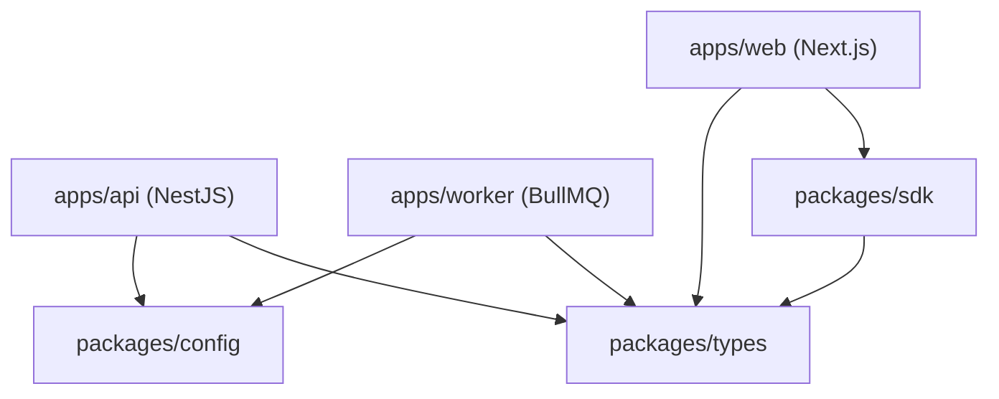

# Repo Builder Skill Examples

This document demonstrates how the repo-builder skill should convert architecture inputs into repository structures.

Each example includes:

- system architecture input
- inferred applications
- repository layout
- infrastructure setup

---

# Example 1 — Fullstack SaaS Monorepo

## Architecture Input

Frontend:
- Next.js dashboard
- authentication pages
- admin panel

Backend:
- NestJS API
- PostgreSQL
- Prisma ORM
- Redis queue

Integrations:
- Stripe
- S3 storage
- SendGrid

---

## Repo Structure


repo/
apps/
web/
api/
worker/
packages/
types/
sdk/
config/
infra/
docker/
scripts/
docs/


---

## Applications

apps/web  
Next.js frontend application

apps/api  
NestJS API server

apps/worker  
background job processor

---

## Shared Packages

packages/types  
shared TypeScript types

packages/sdk  
internal API client

packages/config  
shared configuration utilities

---

## Infrastructure


infra/docker/
docker-compose.yml


Services:

- postgres
- redis
- api
- worker
- web

---

# Example 2 — Simple Fullstack Project

## Architecture Input

Frontend:
React SPA

Backend:
Express API

Database:
PostgreSQL

---

## Repo Structure


repo/
web/
api/
infra/
docs/


---

## Services

web  
React frontend

api  
Express backend

infra  
Docker + database setup

---

# Example 3 — Microservice Backend

## Architecture Input

Services:

- auth service
- billing service
- notification service

Infrastructure:

- PostgreSQL
- Redis
- Kafka

---

## Repo Structure


repo/
apps/
auth-service/
billing-service/
notification-service/
packages/
types/
sdk/
infra/
docker/
scripts/
docs/


---

# Example 4 — Worker Heavy System

## Architecture Input

Backend:
FastAPI

Workers:
image processing
email delivery
analytics aggregation

Queue:
Redis + Celery

---

## Repo Structure


repo/
apps/
api/
worker/
packages/
types/
infra/
docker/
docs/


Workers live in apps/worker.

API server and worker runtime must be separate.

---

# Key Learning Patterns

The repo-builder agent must apply:

1. multi-app systems → monorepo
2. shared logic → packages
3. infra → infra folder
4. background jobs → worker service
5. documentation → docs folder
6. security artifacts → `.gitleaks.toml`, `SECURITY.md`, CI scan step (Rule 21)
7. handoff JSON → `repo-handoff.json` following schema v2.1 (Rule 22)
8. dependency visualization → Mermaid diagram in `ARCHITECTURE.md` (Rule 23)
9. deployment target selection → deployment guide chosen from `deployments/` folder, wired to health check probes and CI/CD (Rule 24)
10. observability baseline → health endpoints + structured logging + correlation ID + OTel for multi-service (Rule 25)

---

# Example 5 — Production-Ready Output (Rules 21–23)

This example demonstrates what a complete `/assemble` output looks like with all new rules applied.

## Architecture Input

Frontend:
- Next.js dashboard app

Backend:
- NestJS API
- BullMQ Worker
- PostgreSQL + Prisma

Integrations:
- Stripe
- AWS S3
- SendGrid

---

## Repo Structure

```
taskflow/
├── .github/
│   └── workflows/
│       └── ci.yml               ← Includes npm audit security step
├── apps/
│   ├── web/                     ← Next.js dashboard
│   ├── api/                     ← NestJS API
│   └── worker/                  ← BullMQ Worker
├── packages/
│   ├── types/                   ← Shared TypeScript interfaces
│   ├── sdk/                     ← Internal API client
│   └── config/                  ← Shared config utilities
├── infra/
│   └── docker/
│       └── docker-compose.yml   ← postgres, redis, api, worker, web
├── docs/
├── .env.example                 ← All vars documented
├── .gitignore                   ← Comprehensive for Node + Next + Docker
├── .gitleaks.toml               ← Rule 21: secret scanning config
├── SECURITY.md                  ← Rule 21: vulnerability reporting
├── README.md
├── SETUP.md
├── ARCHITECTURE.md              ← Rule 23: includes Mermaid diagram
├── package.json                 ← Root workspace + dev/build/test scripts
├── tsconfig.base.json
└── repo-handoff.json            ← Rule 22: machine-readable handoff
```

---

## Mermaid Dependency Diagram (Rule 23)

Produced inside `ARCHITECTURE.md`:



---

## Security Baseline (Rule 21)

Files produced:

```
SECURITY.md              — How to report a vulnerability
.gitleaks.toml           — Prevents accidental credential commits
.github/workflows/ci.yml — Includes: npm audit --audit-level=high
.gitignore               — Covers: .env, .env.*, *.pem, *.key
```

---

## repo-handoff.json Sample (Rule 22)

```json
{
  "meta": {
    "generatedBy": "repo-builder-agent",
    "generatedAt": "2026-03-29T14:00:00Z",
    "modeUsed": "/assemble",
    "schemaVersion": "2.1.0"
  },
  "project": {
    "name": "TaskFlow",
    "repoType": "monorepo",
    "deploymentTarget": "railway"
  },
  "frontend": {
    "framework": "Next.js",
    "apps": [{ "name": "web", "path": "apps/web" }]
  },
  "backend": {
    "framework": "NestJS",
    "language": "typescript",
    "services": [
      { "name": "api", "path": "apps/api", "type": "api" },
      { "name": "worker", "path": "apps/worker", "type": "worker" }
    ],
    "database": "PostgreSQL",
    "orm": "Prisma",
    "auth": "JWT"
  },
  "integrations": [
    { "name": "Stripe", "type": "payment", "provider": "Stripe", "envVarsRequired": ["STRIPE_SECRET_KEY", "STRIPE_WEBHOOK_SECRET"] },
    { "name": "S3", "type": "storage", "provider": "AWS S3", "envVarsRequired": ["AWS_ACCESS_KEY_ID", "AWS_SECRET_ACCESS_KEY", "AWS_S3_BUCKET"] },
    { "name": "SendGrid", "type": "email", "provider": "SendGrid", "envVarsRequired": ["SENDGRID_API_KEY", "EMAIL_FROM"] }
  ],
  "infrastructure": {
    "queue": "BullMQ",
    "cache": "Redis",
    "storage": "S3",
    "containerization": "docker-compose",
    "cicd": "github-actions"
  },
  "security": {
    "secretScanningEnabled": true,
    "securityMdIncluded": true,
    "ciSecurityScanStep": true,
    "gitignoreComprehensive": true
  },
  "packages": [
    { "name": "types", "path": "packages/types", "purpose": "types", "consumedBy": ["api", "worker", "web"] },
    { "name": "sdk", "path": "packages/sdk", "purpose": "sdk", "consumedBy": ["web"] },
    { "name": "config", "path": "packages/config", "purpose": "config", "consumedBy": ["api", "worker"] }
  ],
  "assumptions": [
    "Deployment target inferred as Railway from stack simplicity",
    "Redis used for both BullMQ queue and API caching"
  ]
}
```

---

# Example 6 — Fly.io Deployment (Rule 24)

This example demonstrates Rule 24: selecting and applying the correct deployment guide. When `project.deploymentTarget = "fly-io"`, the Repo Builder applies `deployments/fly-io.md`.

## Architecture Input

```json
{
  "project": {
    "name": "ClinicPortal",
    "deploymentTarget": "fly-io",
    "repoType": "monorepo"
  },
  "backend": {
    "framework": "NestJS",
    "services": [
      { "name": "api", "path": "apps/api", "type": "api" }
    ],
    "database": "PostgreSQL 16"
  },
  "infrastructure": {
    "containerization": "docker-compose",
    "cicd": "github-actions"
  }
}
```

## Deployment Artifacts (Rule 24)

Rule 24 requires the Repo Builder to create these files when `deploymentTarget = "fly-io"`:

```
clinicportal/
├── apps/
│   └── api/
│       ├── fly.toml             ← Fly.io app config with health check probe
│       └── Dockerfile           ← Multi-stage build (builder → production)
└── .github/
    └── workflows/
        └── ci.yml               ← fly deploy step wired to main branch push
```

### `apps/api/fly.toml`

```toml
app = "clinicportal-api"
primary_region = "iad"

[build]
  dockerfile = "Dockerfile"

[env]
  PORT = "3000"

[http_service]
  internal_port = 3000
  force_https = true
  auto_stop_machines = false
  auto_start_machines = true
  min_machines_running = 1

  [[http_service.checks]]
    grace_period = "10s"
    interval = "30s"
    method = "GET"
    path = "/health/ready"
    timeout = "5s"

[[vm]]
  memory = "512mb"
  cpu_kind = "shared"
  cpus = 1
```

### CI/CD Step (GitHub Actions)

```yaml
deploy:
  needs: test
  if: github.ref == 'refs/heads/main'
  runs-on: ubuntu-latest
  steps:
    - uses: actions/checkout@v4
    - uses: superfly/flyctl-actions/setup-flyctl@master
    - run: flyctl deploy --remote-only --config apps/api/fly.toml
      env:
        FLY_API_TOKEN: ${{ secrets.FLY_API_TOKEN }}
```

### Key Fly.io Rules Applied (from `deployments/fly-io.md`)

| Rule | Applied |
|---|---|
| health_check probe → `/health/ready` | ✅ |
| `force_https = true` | ✅ |
| `auto_stop_machines = false` (API) | ✅ |
| `min_machines_running = 1` | ✅ |
| secrets via `fly secrets set` (not env vars) | Documented in `.env.example` |
| Multi-stage Dockerfile | ✅ |

---

# Example 7 — HIPAA Compliance + Observability Baseline (Rule 25)

This example demonstrates Rule 25: the observability baseline required for production deployments. When `compliance.scope = "HIPAA"` and `backend.services[]` has ≥ 2 entries, the Repo Builder applies full observability scaffolding.

## Architecture Input

```json
{
  "project": {
    "name": "TeleMed",
    "deploymentTarget": "fly-io",
    "repoType": "monorepo"
  },
  "backend": {
    "framework": "Django REST Framework",
    "language": "python",
    "services": [
      { "name": "api", "path": "apps/api", "type": "api" },
      { "name": "worker", "path": "apps/worker", "type": "worker" }
    ]
  },
  "compliance": {
    "scope": "HIPAA",
    "phiEntities": ["MedicalRecord", "Prescription", "Diagnosis"],
    "phiEntitiesEncrypted": true,
    "phiAuditLogging": true
  },
  "observability": {
    "structuredLogging": true,
    "loggingLibrary": "structlog",
    "correlationId": true,
    "healthEndpointsPlanned": true,
    "healthLive": "/health/live",
    "healthReady": "/health/ready",
    "prometheusMetrics": true,
    "sentryEnabled": true,
    "distributedTracing": false
  }
}
```

## Observability Artifacts Produced (Rule 25)

### Health Endpoints (`apps/api/core/health.py`)

```python
from django.http import JsonResponse
from django.db import connection
import redis
from django.conf import settings

def health_live(request):
    """Liveness probe — always 200 if process is up."""
    return JsonResponse({"status": "ok"})

def health_ready(request):
    """Readiness probe — checks DB + Redis."""
    checks = {}
    try:
        connection.ensure_connection()
        checks["db"] = "ok"
    except Exception:
        checks["db"] = "fail"

    try:
        r = redis.from_url(settings.REDIS_URL)
        r.ping()
        checks["redis"] = "ok"
    except Exception:
        checks["redis"] = "fail"

    all_ok = all(v == "ok" for v in checks.values())
    status_code = 200 if all_ok else 503
    return JsonResponse(
        {"status": "ok" if all_ok else "degraded", "checks": checks},
        status=status_code
    )
```

### Structured Logging with PHI Redaction (`apps/api/core/logging.py`)

```python
import structlog

def phi_redaction_processor(logger, method_name, event_dict):
    """Strip PHI fields from all log entries before output."""
    PHI_FIELDS = {"ssn", "diagnosis", "medication_name", "patient_name",
                  "date_of_birth", "password", "token"}
    for key in PHI_FIELDS:
        if key in event_dict:
            event_dict[key] = "[REDACTED]"
    return event_dict

structlog.configure(
    processors=[
        structlog.contextvars.merge_contextvars,
        structlog.stdlib.add_log_level,
        structlog.stdlib.add_logger_name,
        phi_redaction_processor,                    # PHI strip before output
        structlog.processors.TimeStamper(fmt="iso"),
        structlog.processors.JSONRenderer(),
    ],
)
```

### Correlation ID Middleware (`apps/api/core/middleware/correlation_id.py`)

```python
import uuid
from structlog.contextvars import bind_contextvars, clear_contextvars

class CorrelationIdMiddleware:
    def __init__(self, get_response):
        self.get_response = get_response

    def __call__(self, request):
        clear_contextvars()
        request_id = request.headers.get("X-Request-ID") or str(uuid.uuid4())
        bind_contextvars(request_id=request_id)
        response = self.get_response(request)
        response["X-Request-ID"] = request_id
        return response
```

### `.env.example` (Rule 25 required vars)

```bash
# Observability (Rule 25 — mandatory)
LOG_LEVEL=info
SERVICE_NAME=telemed-api
SENTRY_DSN=

# Health check config
REDIS_URL=redis://localhost:6379
```

### CI Smoke Test (`apps/api/tests/test_health.py`)

```python
import pytest
from django.test import Client

@pytest.mark.django_db
def test_health_live():
    client = Client()
    response = client.get("/health/live")
    assert response.status_code == 200
    assert response.json()["status"] == "ok"

@pytest.mark.django_db
def test_health_ready_passes_when_services_up():
    client = Client()
    response = client.get("/health/ready")
    # In test environment, DB is up; Redis may not be — check structure
    data = response.json()
    assert "status" in data
    assert "checks" in data
    assert "db" in data["checks"]
```

## Compliance Artifacts Produced

| File | Purpose |
|---|---|
| `SECURITY.md` | Vulnerability disclosure + 60-day HIPAA breach notification timeline |
| `.gitleaks.toml` | Secret scanning with medical record pattern rules |
| `HIPAA_BAA_CHECKLIST.md` | Vendors requiring BAA: AWS S3, Daily.co, Resend, Twilio |
| `DATA_RETENTION_POLICY.md` | 7-year PHI retention, legal hold procedure |
| `.secrets.baseline` | detect-secrets baseline for CI |

## Observability Checklist (Rule 25)

| Requirement | Status |
|---|---|
| `/health/live` endpoint | ✅ Produced |
| `/health/ready` endpoint (DB + Redis checks) | ✅ Produced |
| Health probes wired to `fly.toml` | ✅ Produced |
| structlog JSON logging | ✅ Produced |
| PHI redaction processor | ✅ Produced (HIPAA scope) |
| Correlation ID middleware (X-Request-ID) | ✅ Produced |
| `LOG_LEVEL`, `SERVICE_NAME`, `SENTRY_DSN` in `.env.example` | ✅ Produced |
| OTel distributed tracing | ⚠️ Deferred to v1.1 (2 services, low cross-service volume) |
| CI smoke test for `/health/ready` | ✅ Produced |
