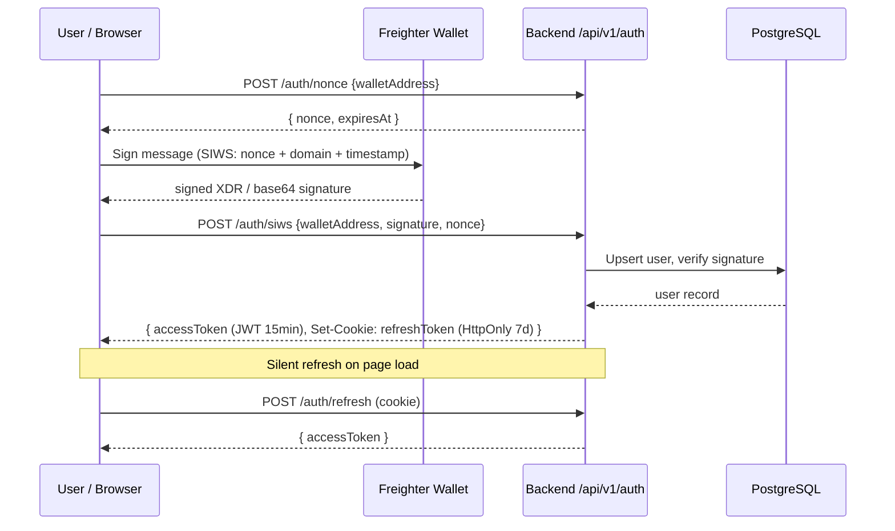
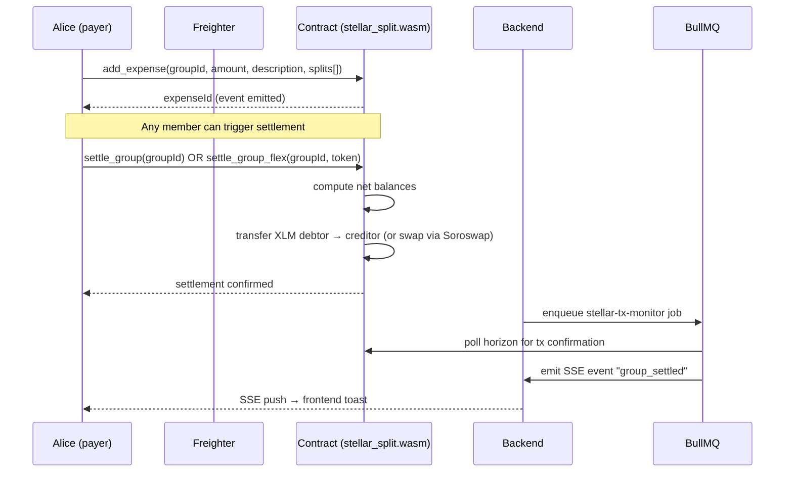
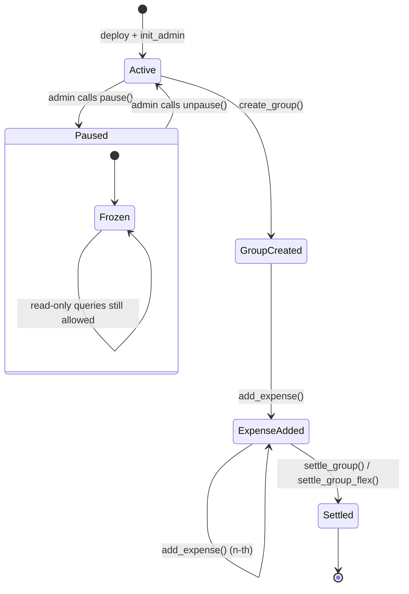
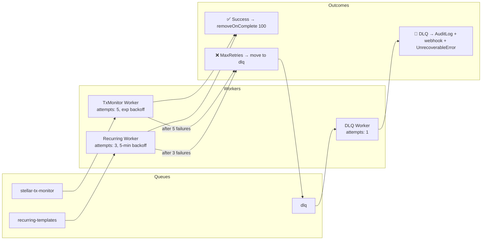

# Birik — System Architecture Overview

> Last updated: 2026-04-24  
> Stack: React 19 · NestJS · Soroban (Stellar) · PostgreSQL · Redis · BullMQ

---

## 1. High-Level System Diagram

```mermaid
graph TB
    subgraph Client["Client (Vite + React 19)"]
        UI[React UI]
        Freighter[Freighter Wallet Extension]
        LocalStore[(localStorage)]
        SW[Service Worker / PWA]
    end

    subgraph Backend["Backend (NestJS on Railway)"]
        API[REST API /api/v1]
        SSE[SSE /events]
        Workers[BullMQ Workers]
        DLQ[Dead Letter Queue]
        Health[/health + /metrics]
    end

    subgraph Infra["Infrastructure"]
        PG[(PostgreSQL)]
        Redis[(Redis)]
        S3[(S3 / R2 — receipts)]
        Prometheus[Prometheus + Grafana]
    end

    subgraph Stellar["Stellar / Soroban"]
        Horizon[Horizon REST]
        Soroban[Soroban RPC]
        Contract[stellar_split.wasm]
        SPLT[SPLT Token Contract]
    end

    %% Client → Backend
    UI -->|JWT Bearer / SIWS| API
    UI -->|SSE stream| SSE

    %% Client → Stellar
    Freighter -->|sign XDR| Soroban
    UI -->|read balances| Horizon
    UI -->|invoke contract| Soroban

    %% Backend → DB / Cache
    API --> PG
    API --> Redis
    Workers --> PG
    Workers --> Redis
    DLQ -->|write AuditLog| PG

    %% Backend → Stellar
    Workers -->|monitor txs| Horizon
    Workers -->|confirm settlement| Soroban

    %% Backend → Storage
    API --> S3

    %% Observability
    Health --> Prometheus

    %% Soroban internals
    Soroban --> Contract
    Contract -->|mint/transfer| SPLT
```

---

## 2. Authentication Flow (SIWS)



---

## 3. Expense → Settlement Flow



---

## 4. Soroban Contract State Machine



---

## 5. BullMQ Worker Pipeline



---

## 6. Frontend Bundle Architecture

```mermaid
graph LR
    subgraph Entry["Entry (main.tsx)"]
        Main[main chunk\n~180 KB gzip]
    end

    subgraph Vendor["Vendor chunks (lazy)"]
        VendorCore[vendor-stellar\n@stellar/stellar-sdk]
        VendorMotion[vendor-motion\nframer-motion]
        VendorOCR[vendor-ocr\ntesseract.js\n~4 MB, loaded only on receipt scan]
        VendorPDF[vendor-pdf\njspdf + html2canvas\nloaded only on export]
    end

    subgraph Routes["Route chunks (lazy)"]
        Landing[Landing]
        Dashboard[Dashboard]
        GroupDetail[GroupDetail]
        Reputation[ReputationDashboard]
        Referral[ReferralDashboard]
        Settings[SettingsPage]
        UseCases[UseCasesPage]
        Leaderboard[LeaderboardPage]
    end

    Main --> VendorCore
    Main --> VendorMotion
    Main -.->|dynamic import on demand| VendorOCR
    Main -.->|dynamic import on demand| VendorPDF
    Main -.->|React.lazy| Landing
    Main -.->|React.lazy| Dashboard
    Main -.->|React.lazy| GroupDetail
    Main -.->|React.lazy| Reputation
    Main -.->|React.lazy| Referral
    Main -.->|React.lazy| Settings
    Main -.->|React.lazy| UseCases
    Main -.->|React.lazy| Leaderboard
```

---

## 7. Emergency Pause Circuit-Breaker

```mermaid
flowchart TD
    Admin[Admin detects exploit] -->|calls pause| Contract
    Contract -->|DataKey::Paused = true\nin instance storage| Storage[(Instance storage)]

    subgraph Read-only still works
        Q1[get_group]
        Q2[is_paused_query]
        Q3[get_expenses]
    end

    subgraph Blocked during pause
        M1[create_group]
        M2[add_expense]
        M3[settle_group]
        M4[register_referral]
        M5[add_member / remove_member]
        M6[cancel_last_expense]
    end

    Storage -->|is_paused check on entry| Blocked during pause
    Storage --> Read-only still works

    Admin -->|fix deployed, calls unpause| Contract
    Contract -->|DataKey::Paused = false| Storage
```

---

## 8. Data Flow — Receipt Import

```mermaid
flowchart LR
    User -->|tap scan| ImportModal
    ImportModal -->|lazy load| Tesseract["tesseract.js\n(vendor-ocr chunk)"]
    Tesseract -->|OCR result| Parser["category-matcher.ts"]
    Parser -->|structured Expense| ImportModal
    ImportModal -->|prefill| AddExpenseForm
    AddExpenseForm -->|add_expense()| Contract["Soroban Contract"]

    User -->|upload photo| Pinata["IPFS / R2"]
    Pinata -->|CID / URL| Expense["Expense.receiptUrl"]
```

---

## Key Numbers

| Metric | Value |
|--------|-------|
| Contract WASM size (opt-level=z) | ~58 KB |
| Initial JS bundle (gzip) | ~180 KB |
| Vendor-OCR chunk | ~4 MB (lazy) |
| Soroban ledger close time | ~5 s |
| Settlement P95 target | < 60 s |
| DB backup RPO | 24 h |
| DB restore RTO | ~15 min |
| JWT access token TTL | 15 min |
| JWT refresh token TTL | 7 days |
| BullMQ job retention (success) | 100 jobs |
